Certainly! Integrating "Blockchain Search" introduces fascinating new dimensions to the search engine. This typically involves searching for data within decentralized ledgers, which presents unique challenges and opportunities compared to traditional web or document search.

Here's an updated design incorporating Blockchain Search functionalities, maintaining the structure and depth of the previous solution.

---

## 1. High-Level Design (HLD) with Blockchain Search

The core layers remain, but we introduce a dedicated "Blockchain Ingestion & Indexing" pathway and adapt the "Query Processing" and "Ranking" layers to handle blockchain-specific data and queries.

```mermaid
graph TD
    subgraph User Interaction
        A[User Client/Browser] --> B[API Gateway/Load Balancer];
    end

    subgraph Query Processing & Search
        B --> C[Query Processing Service];
        C --> C1[Query Parser];
        C --> C2[Query Rewriter/Expander];
        C1 & C2 --> C3[Distributed Query Orchestrator];
        C3 --> D[Search Service:Distributed];
        D --> D1[Keyword Search:Inverted Index Lookup];
        D --> D2[Semantic Search:Vector Index Lookup];
        D --> D3[Blockchain Search:Blockchain Index Lookup];
        D1 & D2 & D3 --> E[Ranking Service];
        E --> E1[Learning to Rank :ML Models];
        E --> E2[Relevance Scoring :BM25, TF-IDF];
        E --> E3[Personalization/Freshness Boost];
        E --> F[Results Aggregator/Post-processor];
        F --> B;
    end

    subgraph Data Ingestion & Indexing
        G[Data Sources :Web Crawlers, Databases, APIs] --> H[Data Ingestion Service];
        H --> H1[Crawlers/Scrapers :Distributed];
        H --> H2[Parsers/Extractors];
        H2 --> I[Message Queue :Kafka/Pulsar];

        G_BC[Blockchain Nodes/APIs :Ethereum, Bitcoin, etc.] --> H_BC[Blockchain Ingestion Service];
        H_BC --> H_BC1[Blockchain Data Scrapers/Listeners];
        H_BC --> H_BC2[Blockchain Data Normalizers];
        H_BC2 --> I_BC[Blockchain Data Message Queue :Kafka/Pulsar];

        I --> J[Data Processing Service :Traditional];
        J --> J1[Normalization/Cleaning];
        J --> J2[Entity Extraction/Language Detection];
        J --> K[Indexing Service :Traditional];
        K --> K1[Index Builder :Tokenization, Stemming, etc.];
        K --> K2[Distributed Index Management];
        K --> L[Distributed Index :Inverted Index, Forward Index];
        K --> M[Vector Index:ANN];

        I_BC --> J_BC[Blockchain Data Processing Service];
        J_BC --> J_BC1[Transaction/Block Parsing];
        J_BC --> J_BC2[Smart Contract Event Decoding];
        J_BC --> J_BC3[Address/Token Profiling];
        J_BC --> K_BC[Blockchain Indexing Service];
        K_BC --> K_BC1[Blockchain Index Builder];
        K_BC --> K_BC2[Blockchain Index Management];
        K_BC --> L_BC[Blockchain Index :Structured/Semi-structured];

        L & M & L_BC --> D[Search Service reads from all indexes];
    end

    subgraph Data Storage & Databases
        L --> S1[NoSQL Store :Elasticsearch/Solr/Cassandra for Inverted Index];
        M --> S2[Vector Database:Milvus/Pinecone for Vector Index];
        L_BC --> S5[Distributed SQL/NoSQL :ClickHouse/Cassandra for Blockchain Data];
        J --> S3[Distributed Document Store :HDFS/S3/Cassandra for Raw/Processed Docs];
        E1 --> S4[SQL DB :PostgreSQL/CockroachDB for User Profiles/Ranking Features];
        S1 & S2 & S3 & S4 & S5 --> Z[Data Replication/Sharding];
    end

    subgraph AI/ML Models
        E --> N[ML Model Serving :BERT/TF-IDF/PageRank];
        N --> O[Offline Model Training :TensorFlow/PyTorch];
        S3 --> O[Training data from processed docs];
        S4 --> O[Features from user profiles/ranking];
        S5 --> O[Blockchain data for ML models e.g., anomaly detection];
    end

    subgraph Infrastructure & Operations
        P[Monitoring & Alerting :Prometheus/Grafana] --> Q[Logging :ELK Stack];
        Q --> R[Distributed Tracing :Jaeger/Zipkin];
        Z --> P;
        K --> P; K_BC --> P[Monitor both indexing services];
        D --> P;
        E --> P;
        S1 --> P; S2 --> P; S3 --> P; S4 --> P; S5 --> P[Monitor all data stores];
    end

    subgraph Distributed Components & Networking
        B -- HTTP/gRPC --> C;
        C3 -- RPC/gRPC --> D;
        D -- RPC/gRPC --> E;
        E -- RPC/gRPC --> F;
        H -- Kafka/Pulsar --> I;
        I -- Kafka/Pulsar --> J;
        J -- RPC/gRPC --> K;
        K -- RPC/gRPC --> L;
        K -- RPC/gRPC --> M;

        H_BC -- Kafka/Pulsar --> I_BC;
        I_BC -- Kafka/Pulsar --> J_BC;
        J_BC -- RPC/gRPC --> K_BC;
        K_BC -- RPC/gRPC --> L_BC;

        O -- Model Push --> N;
        Z -- Replication --> L;
        Z -- Replication --> M;
        Z -- Replication --> S1;
        Z -- Replication --> S2;
        Z -- Replication --> S3;
        Z -- Replication --> S4;
        Z -- Replication --> S5;
    end

    style A fill:#e0f2f7,stroke:#333,stroke-width:2px;
    style B fill:#c8e6c9,stroke:#333,stroke-width:2px;
    style C fill:#c8e6c9,stroke:#333,stroke-width:2px;
    style D fill:#c8e6c9,stroke:#333,stroke-width:2px;
    style E fill:#c8e6c9,stroke:#333,stroke-width:2px;
    style F fill:#c8e6c9,stroke:#333,stroke-width:2px;
    style G fill:#f7e0f2,stroke:#333,stroke-width:2px;
    style H fill:#f7e0f2,stroke:#333,stroke-width:2px;
    style I fill:#f7e0f2,stroke:#333,stroke-width:2px;
    style J fill:#f7e0f2,stroke:#333,stroke-width:2px;
    style K fill:#f7e0f2,stroke:#333,stroke-width:2px;
    style L fill:#f2f7e0,stroke:#333,stroke-width:2px;
    style M fill:#f2f7e0,stroke:#333,stroke-width:2px;
    style N fill:#e0f7f2,stroke:#333,stroke-width:2px;
    style O fill:#e0f7f2,stroke:#333,stroke-width:2px;
    style P fill:#f7f2e0,stroke:#333,stroke-width:2px;
    style Q fill:#f7f2e0,stroke:#333,stroke-width:2px;
    style R fill:#f7f2e0,stroke:#333,stroke-width:2px;
    style S1 fill:#f2e0f7,stroke:#333,stroke-width:2px;
    style S2 fill:#f2e0f7,stroke:#333,stroke-width:2px;
    style S3 fill:#f2e0f7,stroke:#333,stroke-width:2px;
    style S4 fill:#f2e0f7,stroke:#333,stroke-width:2px;
    style S5 fill:#f2e0f7,stroke:#333,stroke-width:2px; % New
    style Z fill:#e0f7f2,stroke:#333,stroke-width:2px;
    style C1 fill:#e6c8e9,stroke:#333,stroke-width:1px;
    style C2 fill:#e6c8e9,stroke:#333,stroke-width:1px;
    style C3 fill:#e6c8e9,stroke:#333,stroke-width:1px;
    style D1 fill:#e6c8e9,stroke:#333,stroke-width:1px;
    style D2 fill:#e6c8e9,stroke:#333,stroke-width:1px;
    style D3 fill:#e6c8e9,stroke:#333,stroke-width:1px; % New
    style E1 fill:#e6c8e9,stroke:#333,stroke-width:1px;
    style E2 fill:#e6c8e9,stroke:#333,stroke-width:1px;
    style E3 fill:#e6c8e9,stroke:#333,stroke-width:1px;
    style H1 fill:#e6c8e9,stroke:#333,stroke-width:1px;
    style H2 fill:#e6c8e9,stroke:#333,stroke-width:1px;
    style J1 fill:#e6c8e9,stroke:#333,stroke-width:1px;
    style J2 fill:#e6c8e9,stroke:#333,stroke-width:1px;
    style K1 fill:#e6c8e9,stroke:#333,stroke-width:1px;
    style K2 fill:#e6c8e9,stroke:#333,stroke-width:1px;

    style G_BC fill:#f7e0f2,stroke:#333,stroke-width:2px; % New
    style H_BC fill:#f7e0f2,stroke:#333,stroke-width:2px; % New
    style I_BC fill:#f7e0f2,stroke:#333,stroke-width:2px; % New
    style J_BC fill:#f7e0f2,stroke:#333,stroke-width:2px; % New
    style K_BC fill:#f7e0f2,stroke:#333,stroke-width:2px; % New
    style L_BC fill:#f2f7e0,stroke:#333,stroke-width:2px; % New
    style H_BC1 fill:#e6c8e9,stroke:#333,stroke-width:1px; % New
    style H_BC2 fill:#e6c8e9,stroke:#333,stroke-width:1px; % New
    style J_BC1 fill:#e6c8e9,stroke:#333,stroke-width:1px; % New
    style J_BC2 fill:#e6c8e9,stroke:#333,stroke-width:1px; % New
    style J_BC3 fill:#e6c8e9,stroke:#333,stroke-width:1px; % New
    style K_BC1 fill:#e6c8e9,stroke:#333,stroke-width:1px; % New
    style K_BC2 fill:#e6c8e9,stroke:#333,stroke-width:1px; % New
```

---

## 2. Low-Level Design (LLD) and Key Functionalities with Blockchain Search

### 2.1. Data Ingestion Layer (Distributed)

* **Traditional Data Ingestion (Existing):** Remains the same for web pages, documents, etc.
* **Blockchain Ingestion Service (New):**
    * **Blockchain Data Sources:** Connects to various blockchain networks (e.g., Ethereum, Bitcoin, Solana, Polkadot) via their RPC nodes or dedicated API providers (e.g., Infura, Alchemy, Covalent).
    * **Blockchain Data Scrapers/Listeners:** Continuously listen for new blocks, transactions, and smart contract events. These should be fault-tolerant and handle blockchain reorganizations (forks).
    * **Blockchain Data Normalizers:** Standardize diverse blockchain data formats (e.g., different transaction schemas, token standards like ERC-20, ERC-721, Solana SPL) into a common internal representation.
    * **Blockchain Data Message Queue (Kafka/Pulsar):** Dedicated queue for raw blockchain data to decouple ingestion from processing and provide buffering.

### 2.2. Indexing Layer (Distributed SQL & NoSQL)

* **Traditional Indexing Service (Existing):** For full-text and semantic search of general documents.
* **Blockchain Data Processing Service (New):**
    * **Transaction/Block Parsing:** Detailed parsing of blockchain data to extract fields like sender/receiver addresses, transaction value, gas fees, timestamps, block numbers, block hashes.
    * **Smart Contract Event Decoding:** Crucial for understanding events emitted by smart contracts (e.g., token transfers, NFT mints, DeFi protocol interactions). This often requires ABI (Application Binary Interface) definitions.
    * **Address/Token Profiling:** Building rich profiles for addresses (e.g., their associated tokens, past transactions, contract interactions, network activity) and tokens (e.g., total supply, holders, trading volume).
* **Blockchain Indexing Service (New):**
    * **Purpose:** Builds and maintains specialized indexes for blockchain data.
    * **Data Structures:**
        * **Structured/Semi-structured Data Stores (SQL/NoSQL - e.g., ClickHouse, PostgreSQL, Cassandra):** Ideal for storing and querying structured blockchain data (transactions, blocks, addresses, token metadata). These allow for complex analytical queries (e.g., "all transactions involving address X in the last 24 hours").
        * **Graph Databases (e.g., Neo4j, ArangoDB):** Excellent for representing and querying relationships between addresses, transactions, and smart contracts, enabling "follow-the-money" or network analysis.
        * **Time-Series Databases (e.g., InfluxDB):** Useful for storing historical blockchain metrics like gas prices, transaction volume over time.
    * **Indexing Logic:** Focuses on indexing specific fields (addresses, transaction hashes, block numbers, token IDs, event types, timestamps) for fast lookups. May involve creating composite indexes for multi-field queries.

### 2.3. Query Processing Layer

* **API Gateway/Load Balancer (Existing):** Routes requests, now includes blockchain-specific query endpoints.
* **Query Parser (Enhanced):** Must understand blockchain-specific query syntax, such as searching by:
    * Transaction hash, block number, address.
    * Smart contract address and event types.
    * Token ID or token name.
    * Time ranges, value ranges.
    * Potentially, more complex graph-like queries (e.g., "find paths between two addresses").
* **Query Rewriter/Expander (Enhanced):**
    * **Address/Transaction Resolution:** Resolve short/partial inputs to full addresses/hashes.
    * **Blockchain Contextualization:** Add implicit filters based on query context (e.g., if a user searches for a specific token, automatically filter by relevant contract addresses).
    * **Cross-chain Awareness:** Potentially translate queries across different blockchain networks if supported by the underlying index.
* **Distributed Query Orchestrator (Enhanced):** Now orchestrates searches across traditional indexes *and* blockchain indexes. This might involve:
    * Parallel execution of queries against different index types.
    * Combining results from traditional and blockchain searches if a query spans both domains (e.g., "search for documents mentioning a specific NFT and its transaction history").

### 2.4. Ranking Layer (AI-Powered Search)

* **Traditional Ranking (Existing):** Remains for general search.
* **Blockchain Search Ranking (New/Enhanced):**
    * **Retrieval:**
        * **Structured Query Retrieval:** Direct lookups in the structured blockchain indexes for exact matches (e.g., specific transaction hash).
        * **Behavioral/Pattern Matching:** For identifying suspicious activity or specific transaction patterns (e.g., "flash loan" transactions) using analytical queries on the structured data.
        * **Graph Traversal:** For queries involving relationships (e.g., "addresses connected to X").
    * **Scoring/Ranking for Blockchain Data:**
        * **Volume/Value:** Rank transactions by value or number of similar transactions.
        * **Age/Recency:** Prioritize recent blocks/transactions.
        * **Address Reputation/Trust Scores:** Leverage external data or on-chain analysis to assign a "reputation" score to addresses, influencing search results (e.g., filtering out known scam addresses).
        * **Smart Contract Popularity/Usage:** Rank contracts based on interaction volume or number of unique users.
        * **Anomaly Detection:** AI models can identify unusual transaction patterns that might indicate fraud or exploits, and rank these higher if relevant to the query.
        * **AI Models (for Blockchain Data):**
            * **Graph Neural Networks (GNNs):** For analyzing transaction graphs and identifying communities, anomalies, or important nodes.
            * **Time Series Analysis Models:** For detecting trends or anomalies in blockchain metrics.
            * **Classification Models:** To categorize transactions (e.g., transfer, swap, contract interaction).

---

## 3. Non-Functional Requirements (NFRs) - Enhanced for Blockchain

* **Low Latency:**
    * **Real-time Blockchain Ingestion:** Optimize scrapers and listeners to process new blocks and transactions with minimal delay.
    * **Highly Optimized Blockchain Indexes:** Design indexes (especially those for transaction hashes and addresses) for extremely fast lookups.
    * **Caching Blockchain Data:** Cache frequently accessed block data, transaction details, and address profiles.
* **High Throughput:**
    * **Massive Parallelism for Blockchain Sync:** Synchronize historical blockchain data (which can be terabytes) in parallel.
    * **Efficient Event Processing:** Handle a high volume of real-time smart contract events.
* **Scalability:**
    * **Blockchain-Specific Sharding:** Design sharding strategies for blockchain data (e.g., sharding by block number range, or by a hash of the address for even distribution).
    * **Elastic Blockchain Indexing:** Dynamically scale resources for blockchain ingestion and indexing based on blockchain network activity.
* **Fault Tolerance/High Availability:**
    * **Blockchain Reorganization Handling:** Crucial to gracefully handle blockchain forks and re-orgs, ensuring indexed data remains accurate.
    * **Resilient Node Connections:** Implement robust connection management to blockchain RPC nodes, with retry mechanisms and failover.
    * **Data Integrity Checks:** Implement checks to ensure the indexed blockchain data accurately reflects the on-chain state.
* **Data Consistency:** Given the immutable nature of blockchains, the challenge shifts to *eventual consistency* of the *indexed representation* of the blockchain state. The index should accurately reflect the canonical chain.

---

## 4. DSA - Algorithms & Protocols Used - Enhanced for Blockchain

* **Data Structures:**
    * **Merkle Trees:** Fundamental to blockchains, though not directly used in the search index, understanding them is key for validation.
    * **Bloom Filters:** Can be used for quick existence checks (e.g., "does this block contain this address?") before hitting the main index.
    * **Specialized SQL/NoSQL Indexes:** B-trees, hash indexes, composite indexes optimized for blockchain fields (e.g., `(block_number, transaction_index)`, `(from_address, timestamp)`).
    * **Graph Data Structures:** Adjacency lists/matrices for representing transaction networks.
* **Algorithms:**
    * **Hashing Algorithms:** SHA-256, Keccak-256 (blockchain specific).
    * **Cryptography:** For verifying signatures if needed for data integrity (though typically handled by blockchain nodes).
    * **Time Series Algorithms:** For analyzing trends in blockchain data (e.g., moving averages of gas prices).
    * **Graph Algorithms:**
        * **Breadth-First Search (BFS)/Depth-First Search (DFS):** For traversing transaction paths.
        * **Centrality Measures (Degree, Betweenness, Closeness):** To identify important addresses or contracts.
        * **Community Detection Algorithms:** To find groups of related addresses.
    * **Machine Learning Algorithms (Blockchain-specific):**
        * **Anomaly Detection:** Isolation Forest, One-Class SVM for identifying suspicious transactions.
        * **Clustering:** K-Means for grouping similar addresses or contract interactions.
        * **Time Series Forecasting:** ARIMA, LSTMs for predicting blockchain activity.
* **Distributed System Protocols:**
    * **RPC (Remote Procedure Call):** For interacting with blockchain nodes (e.g., Web3.js/ethers.js for Ethereum RPC).
    * **Consensus:** For managing the distributed index's consistency, same as before (Raft/Paxos).

---

## 5. Tech Stack - Enhanced for Blockchain

* **Programming Languages:** Java, Go, Python (for AI/ML and blockchain interaction), Rust (for high-performance blockchain listeners).
* **Data Ingestion (Blockchain):**
    * **Blockchain Client Libraries:** Web3.js/ethers.js (Ethereum), web3.py, Bitcoin RPC client libraries.
    * **Dedicated Listeners/Scrapers:** Custom Go/Rust services or commercial blockchain indexing tools (e.g., The Graph for subgraphs, Covalent for APIs, BlockDaemon).
    * **Message Queues:** Apache Kafka, Apache Pulsar.
* **Data Storage (Blockchain):**
    * **Distributed SQL/Columnar NoSQL:** ClickHouse (excellent for large-scale analytical queries on structured data), PostgreSQL (with partitioning for large tables), Apache Cassandra (for high write throughput of semi-structured data).
    * **Graph Databases:** Neo4j, ArangoDB, Amazon Neptune (if using AWS).
    * **Time-Series Databases:** InfluxDB, TimescaleDB.
* **Indexing & Search Libraries (Blockchain Specific):**
    * Not always a "search library" in the traditional sense, but highly optimized database queries and custom indexing logic within the data stores.
    * For on-chain data, sometimes **Elasticsearch** can still be used if the data is denormalized into JSON documents.
* **AI/ML (Blockchain-specific):**
    * **Graph ML Libraries:** PyTorch Geometric, DGL (Deep Graph Library).
    * **Time Series Libraries:** Statsmodels, Prophet.
    * **General ML Frameworks:** TensorFlow, PyTorch.
* **Infrastructure & Operations:** Same as before, but with added monitoring for blockchain node health and sync status.

By integrating these blockchain-specific components and considerations, the search engine platform becomes a powerful tool not just for traditional data, but also for exploring the vast and dynamic world of decentralized ledgers.
