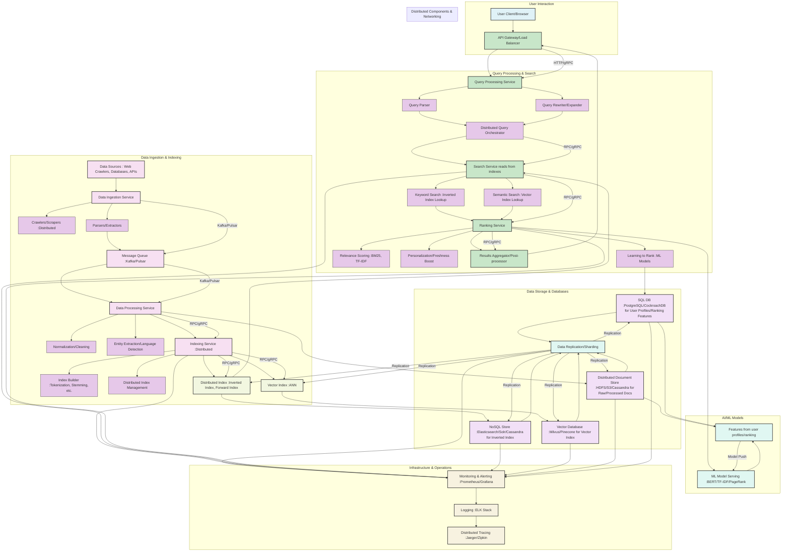

# Design a Search Engine System Platform: Claude
Functionalities Requirements:
- Distributed
- SQL,NO SQL-Distributed
- AI-Powered Search
- Full Text Search
- Non -Functional Requirements: Low Latency, High Throughput, Scalability
- LLD,HLD
- DSA-Algorithms & Protocol Used
- Tech Stack    
- Ignore writing code
- Complete Architecture diagram with all layers and components

# Distributed Search Engine System Platform Design

## 1. High-Level Design (HLD)

### 1.1 System Overview
The distributed search engine platform is designed as a microservices architecture with multiple layers handling different aspects of search functionality, from data ingestion to query processing and result delivery.

### 1.2 Core Components Architecture

```
┌─────────────────────────────────────────────────────────────────┐
│                     PRESENTATION LAYER                          │
├─────────────────────────────────────────────────────────────────┤
│  Web Interface  │  Mobile Apps  │  REST APIs  │  GraphQL APIs   │
└─────────────────────────────────────────────────────────────────┘
                                    │
┌─────────────────────────────────────────────────────────────────┐
│                    API GATEWAY LAYER                            │
├─────────────────────────────────────────────────────────────────┤
│  Load Balancer  │  Rate Limiter  │  Auth Service  │  Routing    │
└─────────────────────────────────────────────────────────────────┘
                                    │
┌─────────────────────────────────────────────────────────────────┐
│                   APPLICATION LAYER                             │
├─────────────────────────────────────────────────────────────────┤
│ Search Service │ Indexing Service │ AI/ML Service │ Analytics   │
│ Query Parser   │ Ranking Engine   │ Cache Manager │ Monitoring  │
└─────────────────────────────────────────────────────────────────┘
                                    │
┌─────────────────────────────────────────────────────────────────┐
│                     DATA LAYER                                  │
├─────────────────────────────────────────────────────────────────┤
│ Search Indices │ SQL Databases    │ NoSQL Stores  │ Vector DBs  │
│ (Elasticsearch)│ (PostgreSQL)     │ (MongoDB)     │ (Pinecone)  │
└─────────────────────────────────────────────────────────────────┘
                                    │
┌─────────────────────────────────────────────────────────────────┐
│                 INFRASTRUCTURE LAYER                           │
├─────────────────────────────────────────────────────────────────┤
│ Container Orchestration │ Message Queues │ Storage │ Monitoring │
│ (Kubernetes)           │ (Apache Kafka) │ (S3)    │ (Prometheus)│
└─────────────────────────────────────────────────────────────────┘
```

## 2. Low-Level Design (LLD)

### 2.1 Core Service Components

#### Search Service
- **Query Processing Engine**: Parses and optimizes search queries
- **Multi-Index Coordinator**: Routes queries to appropriate indices
- **Result Aggregator**: Combines and ranks results from multiple sources
- **Cache Layer**: Redis-based caching for frequent queries

#### Indexing Service
- **Web Crawler**: Distributed crawling system
- **Document Processor**: Text extraction and preprocessing
- **Index Builder**: Creates and maintains search indices
- **Real-time Indexer**: Handles live document updates

#### AI/ML Service
- **Semantic Search Engine**: Vector-based similarity search
- **Query Understanding**: Intent recognition and query expansion
- **Personalization Engine**: User behavior analysis and recommendations
- **Auto-completion Service**: Real-time query suggestions

### 2.2 Data Flow Architecture

```
Document Sources → Crawlers → Message Queue → Processing Pipeline
                                                      │
Vector Embeddings ← AI/ML Service ← Document Parser ←┘
        │
        ▼
Vector Database → Search Service ← User Query
        │                │
        └────────────────▼
               Search Results
```

## 3. Distributed Architecture

### 3.1 Horizontal Scaling Strategy

#### Sharding Strategy
- **Document-based Sharding**: Documents distributed across shards by hash
- **Feature-based Sharding**: Different content types on different shards
- **Geographic Sharding**: Regional data distribution for latency optimization

#### Replication Strategy
- **Master-Slave Replication**: For read scalability
- **Multi-Master Replication**: For write availability
- **Cross-Region Replication**: For disaster recovery

### 3.2 Cluster Management
- **Service Discovery**: Consul/Eureka for dynamic service registration
- **Load Balancing**: HAProxy/NGINX for traffic distribution
- **Health Monitoring**: Automated failover and recovery

## 4. Database Architecture

### 4.1 SQL Distributed Databases

#### Primary SQL Store (PostgreSQL Cluster)
- **Use Cases**: User profiles, search analytics, configuration data
- **Sharding**: Horizontal partitioning by user_id/document_id
- **Replication**: Master-slave with read replicas
- **Consistency**: Strong consistency for critical operations

#### Distributed SQL Configuration
```
┌─────────────────┐    ┌─────────────────┐    ┌─────────────────┐
│   SQL Shard 1   │    │   SQL Shard 2   │    │   SQL Shard 3   │
│   (Users 1-33%) │    │   (Users 34-66%)│    │   (Users 67-100%)│
│                 │    │                 │    │                 │
│ Master + 2 Read │    │ Master + 2 Read │    │ Master + 2 Read │
│   Replicas      │    │   Replicas      │    │   Replicas      │
└─────────────────┘    └─────────────────┘    └─────────────────┘
```

### 4.2 NoSQL Distributed Databases

#### Document Store (MongoDB Cluster)
- **Use Cases**: Raw documents, metadata, crawl data
- **Sharding Strategy**: Hash-based on document_id
- **Replica Sets**: 3-node replica sets per shard
- **Consistency**: Eventual consistency with write concerns

#### Key-Value Store (Redis Cluster)
- **Use Cases**: Caching, session management, real-time data
- **Partitioning**: Hash slot-based partitioning
- **Replication**: Master-slave with sentinel monitoring
- **Persistence**: RDB + AOF for durability

### 4.3 Search-Specific Databases

#### Elasticsearch Cluster
- **Index Strategy**: Time-based and content-type indices
- **Sharding**: Configurable shards per index
- **Replication**: 1-2 replicas per shard
- **Optimization**: Hot-warm-cold architecture

#### Vector Database (Pinecone/Weaviate)
- **Use Cases**: Semantic search, AI-powered recommendations
- **Indexing**: HNSW (Hierarchical Navigable Small World)
- **Scalability**: Automatic scaling based on query load
- **Integration**: Real-time vector updates

## 5. AI-Powered Search Features

### 5.1 Semantic Search
- **Embedding Models**: BERT, RoBERTa, Sentence Transformers
- **Vector Similarity**: Cosine similarity, Euclidean distance
- **Hybrid Search**: Combining keyword and semantic search
- **Query Expansion**: Automatic query enhancement

### 5.2 Machine Learning Pipeline
- **Feature Engineering**: TF-IDF, BM25, word embeddings
- **Ranking Models**: Learning-to-Rank (LTR) algorithms
- **Personalization**: Collaborative filtering, content-based filtering
- **A/B Testing**: Continuous model evaluation and improvement

### 5.3 Natural Language Processing
- **Query Understanding**: Intent classification, entity recognition
- **Auto-complete**: Trie-based suggestions with ML ranking
- **Spell Correction**: Levenshtein distance with context awareness
- **Language Detection**: Multi-language search support

## 6. Full-Text Search Implementation

### 6.1 Indexing Strategy
- **Inverted Index**: Term → Document mapping
- **Forward Index**: Document → Term mapping for ranking
- **Positional Index**: Term positions for phrase queries
- **Field-specific Indices**: Title, content, metadata separation

### 6.2 Text Processing Pipeline
1. **Tokenization**: Break text into terms
2. **Normalization**: Lowercase, Unicode normalization
3. **Stop Word Removal**: Language-specific stop words
4. **Stemming/Lemmatization**: Root form extraction
5. **N-gram Generation**: For fuzzy matching

### 6.3 Query Processing
- **Query Parsing**: Boolean, phrase, wildcard queries
- **Query Optimization**: Term reordering, early termination
- **Scoring**: BM25, TF-IDF with custom boosting
- **Result Ranking**: ML-based ranking with multiple signals

## 7. Non-Functional Requirements Implementation

### 7.1 Low Latency Optimization

#### Caching Strategy
- **L1 Cache**: Application-level caching (Redis)
- **L2 Cache**: CDN for static content
- **L3 Cache**: Database query result caching
- **Cache Warming**: Preloading popular queries

#### Performance Optimizations
- **Index Optimization**: Efficient data structures (B+ trees, LSM trees)
- **Query Optimization**: Early termination, parallel processing
- **Network Optimization**: Connection pooling, compression
- **Hardware Optimization**: SSD storage, high-memory nodes

### 7.2 High Throughput Architecture

#### Concurrent Processing
- **Thread Pools**: Configurable thread pools for different operations
- **Async Processing**: Non-blocking I/O operations
- **Batch Processing**: Bulk operations for indexing
- **Pipeline Processing**: Streaming data processing

#### Resource Management
- **Connection Pooling**: Database and service connections
- **Memory Management**: Efficient memory allocation
- **CPU Optimization**: Multi-core processing utilization
- **I/O Optimization**: Asynchronous disk operations

### 7.3 Scalability Features

#### Auto-scaling
- **Horizontal Pod Autoscaler**: Kubernetes-based scaling
- **Vertical Scaling**: Resource adjustment based on load
- **Predictive Scaling**: ML-based capacity planning
- **Geographic Scaling**: Multi-region deployment

#### Load Distribution
- **Consistent Hashing**: Even load distribution
- **Circuit Breakers**: Fault tolerance patterns
- **Rate Limiting**: Request throttling per user/IP
- **Queue Management**: Message queue-based load handling

## 8. Algorithms and Data Structures

### 8.1 Search Algorithms

#### Core Search Algorithms
- **BM25**: Probabilistic ranking function
- **TF-IDF**: Term frequency-inverse document frequency
- **PageRank**: Link-based authority scoring
- **Learning-to-Rank**: Gradient boosting, neural networks

#### Text Processing Algorithms
- **Knuth-Morris-Pratt**: Pattern matching
- **Aho-Corasick**: Multiple pattern matching
- **Levenshtein Distance**: Edit distance for fuzzy matching
- **Soundex/Metaphone**: Phonetic matching

### 8.2 Data Structures

#### Index Data Structures
- **Inverted Index**: HashMap<Term, PostingList>
- **Trie**: Prefix-based search and auto-completion
- **B+ Trees**: Sorted index structures
- **Bloom Filters**: Membership testing with space efficiency

#### Performance Data Structures
- **Skip Lists**: Sorted data with fast search
- **LSM Trees**: Write-optimized data structures
- **HNSW**: Hierarchical navigable small world for vector search
- **Consistent Hashing Ring**: Distributed data placement

### 8.3 Distributed Algorithms

#### Consensus Algorithms
- **Raft**: Leader election and log replication
- **PBFT**: Byzantine fault tolerance
- **Gossip Protocol**: Distributed information propagation

#### Distributed Computing
- **MapReduce**: Distributed data processing
- **Consistent Hashing**: Data distribution and replication
- **Vector Clocks**: Distributed event ordering
- **Merkle Trees**: Data integrity verification

## 9. Protocols and Communication

### 9.1 Communication Protocols
- **HTTP/2**: Efficient web communication
- **gRPC**: High-performance RPC framework
- **WebSocket**: Real-time communication
- **Message Queues**: Apache Kafka, RabbitMQ

### 9.2 Data Serialization
- **Protocol Buffers**: Efficient binary serialization
- **Apache Avro**: Schema evolution support
- **JSON**: Human-readable data exchange
- **MessagePack**: Compact binary format

### 9.3 Security Protocols
- **OAuth 2.0/JWT**: Authentication and authorization
- **TLS 1.3**: Encrypted communication
- **API Rate Limiting**: Token bucket algorithm
- **Data Encryption**: AES-256 for data at rest

## 10. Technology Stack

### 10.1 Programming Languages
- **Java**: Core search services, high performance
- **Python**: AI/ML services, data processing
- **Go**: Infrastructure services, high concurrency
- **JavaScript/TypeScript**: Frontend applications
- **Scala**: Big data processing (Apache Spark)

### 10.2 Frameworks and Libraries
- **Spring Boot**: Java microservices framework
- **FastAPI**: Python web framework for ML services
- **React**: Frontend user interface
- **Apache Spark**: Distributed data processing
- **TensorFlow/PyTorch**: Machine learning frameworks

### 10.3 Databases and Storage
- **Elasticsearch**: Primary search engine
- **PostgreSQL**: Relational data storage
- **MongoDB**: Document storage
- **Redis**: Caching and session storage
- **Apache Cassandra**: Time-series data
- **Amazon S3**: Object storage

### 10.4 Infrastructure and DevOps
- **Kubernetes**: Container orchestration
- **Docker**: Containerization
- **Apache Kafka**: Message streaming
- **NGINX**: Load balancing and reverse proxy
- **Prometheus + Grafana**: Monitoring and alerting
- **ELK Stack**: Logging and analysis

### 10.5 AI/ML Stack
- **Hugging Face Transformers**: Pre-trained models
- **Pinecone/Weaviate**: Vector databases
- **Apache Airflow**: ML pipeline orchestration
- **MLflow**: ML experiment tracking
- **ONNX**: Model deployment and optimization

## 11. System Monitoring and Observability

### 11.1 Metrics and KPIs
- **Query Latency**: P50, P95, P99 response times
- **Throughput**: Queries per second (QPS)
- **Index Health**: Index size, update frequency
- **Cache Hit Ratio**: Cache effectiveness metrics
- **Error Rates**: 4xx, 5xx error percentages

### 11.2 Logging Strategy
- **Structured Logging**: JSON-formatted logs
- **Log Aggregation**: Centralized log collection
- **Search Analytics**: Query patterns and user behavior
- **Performance Profiling**: Application performance insights

### 11.3 Alerting System
- **SLO/SLA Monitoring**: Service level objective tracking
- **Anomaly Detection**: ML-based anomaly identification
- **Escalation Policies**: Multi-tier alerting system
- **Dashboard Integration**: Real-time system health views

## 12. Deployment and Scaling Strategy

### 12.1 Deployment Architecture
- **Blue-Green Deployment**: Zero-downtime deployments
- **Canary Releases**: Gradual feature rollouts
- **Rolling Updates**: Kubernetes-native updates
- **Multi-Region Deployment**: Global service availability

### 12.2 Capacity Planning
- **Resource Estimation**: CPU, memory, storage requirements
- **Growth Projections**: Scaling timeline planning
- **Cost Optimization**: Resource utilization efficiency
- **Performance Testing**: Load testing and benchmarking

This comprehensive design provides a robust, scalable, and high-performance distributed search engine platform that meets all the specified functional and non-functional requirements while incorporating modern architectural patterns and technologies.


# Google Solution :Covering important aspects of the system

To design a robust and scalable search engine system platform, we need to consider various architectural components, data storage strategies, search algorithms, and non-functional requirements.

### 1. High-Level Design (HLD)

The search engine platform can be broadly divided into the following key layers:

* **Data Ingestion Layer:** Responsible for collecting, parsing, and normalizing data from various sources.
* **Indexing Layer:** Transforms processed data into an efficient, searchable index.
* **Query Processing Layer:** Handles user queries, parses them, and orchestrates the search process.
* **Ranking Layer:** Applies relevance algorithms to sort search results.
* **Presentation Layer:** Delivers search results to the user.
* **Monitoring & Management Layer:** Oversees the health and performance of the system.

**Architectural Diagram (HLD):**

```
+---------------------+      +---------------------+
|                     |      |                     |
|  Data Sources       +------>  Data Ingestion     |
| (Web Crawlers,      |      |   (Scrapers, Parsers)|
|  Databases, APIs)   |      |                     |
+---------------------+      +----------+----------+
                                        |
                                        V
+---------------------+      +---------------------+
|                     |      |                     |
|  Message Queue      <------+  Data Processing    |
| (Kafka, RabbitMQ)   |      |  (Normalization,     |
|                     |      |  Entity Extraction) |
+---------------------+      +----------+----------+
                                        |
                                        V
+---------------------+      +---------------------+
|                     |      |                     |
|  Indexing Service   <------+  Index Builder      |
| (Distributed Index) |      | (Inverted Index,    |
|                     |      |  Vector Index)      |
+---------------------+      +----------+----------+
                                        |
                                        V
+---------------------+      +---------------------+
|                     |      |                     |
|  Query Processing   <------+  Load Balancer      |
| (Query Parser,      |      | (NGINX, HAProxy)    |
|  Query Rewriter)    |      |                     |
+---------------------+      +----------+----------+
    ^       |                          ^
    |       |                          |
    |       +--------------------------+
    |                                  |
    |                                  |
+---+----------------------------------+---+
|                                          |
|  Search Service (Distributed Search)     |
|  (Retrieval, Scoring)                    |
+------------------------------------------+
    ^       |
    |       |
    |       V
+---------------------+      +---------------------+
|                     |      |                     |
|  Ranking Service    <------+  AI Models          |
| (ML Models,         |      | (BERT, TF-IDF,      |
|  Relevance Tuning)  |      |  PageRank)          |
+---------------------+      +----------+----------+
          |                            ^
          |                            |
          V                            |
+---------------------+      +---------------------+
|                     |      |                     |
|  Presentation Layer <------+  Analytics/Metrics  |
| (API Gateway, UI)   |      | (Prometheus, Grafana)|
+---------------------+      +----------+----------+

+---------------------------------------------------+
|  Monitoring & Management (Logging, Alerting)      |
+---------------------------------------------------+
```

### 2. Low-Level Design (LLD) - Key Components & Details

#### 2.1. Data Ingestion Layer

* **Crawlers/Scrapers:**
    * **Purpose:** Collect raw data from diverse sources (web, databases, file systems).
    * **Distributed Nature:** Use a distributed crawling framework (e.g., Apache Nutch, Scrapy distributed with Redis) to handle large volumes of data concurrently.
    * **Queueing:** Store URLs to be crawled in a distributed message queue (Kafka) to decouple crawling from processing.
    * **Politeness Policies:** Implement delays and respect `robots.txt` to avoid overloading target servers.
    * **Change Detection:** Efficiently identify new or updated content to re-index.
* **Parsers & Extractors:**
    * **Purpose:** Parse raw data (HTML, JSON, XML, plain text) and extract relevant information (text, metadata, links).
    * **Text Normalization:** Convert text to a consistent format (lowercase, remove punctuation, handle special characters).
    * **Data Validation:** Ensure data quality and consistency.
    * **Language Detection:** Identify the language of the content for language-specific processing.
* **Data Storage (Temporary/Staging):**
    * **Distributed File System:** HDFS or S3 for storing raw and semi-processed data.
    * **Message Queues:** Kafka or Pulsar for streaming data between components, providing fault tolerance and buffering.

#### 2.2. Indexing Layer

* **Distributed Indexing Service:**
    * **Purpose:** Builds and maintains the search index.
    * **Sharding/Partitioning:** Divide the index into smaller, manageable shards across multiple nodes. Each shard can be replicated for high availability.
    * **Inverted Index:** The core data structure for full-text search. Maps terms to documents containing those terms, along with positional information and frequencies.
        * Example: `{"apple": [doc1: [pos1, pos5], doc3: [pos2]], "banana": [doc2: [pos1]]}`
    * **Forward Index:** Maps documents to terms (useful for document-centric operations like document retrieval and field highlighting).
    * **Vector Index (for AI-Powered Search):** Stores dense vector embeddings of documents and queries for semantic search.
        * Techniques: HNSW (Hierarchical Navigable Small World), IVF-Flat (Inverted File Index with Flat Quantization).
    * **Document Store:** A key-value store (e.g., RocksDB, Cassandra) to store the actual document content or a pointer to it, allowing for efficient retrieval of full documents.
* **Index Builder:**
    * **Purpose:** Processes normalized data and creates index structures.
    * **Tokenization:** Breaking down text into individual words or phrases (tokens).
    * **Stemming/Lemmatization:** Reducing words to their root form (e.g., "running" -> "run", "better" -> "good").
    * **Stop Word Removal:** Eliminating common words (e.g., "the", "a", "is") that don't add much meaning.
    * **N-gram Generation:** Creating sequences of N words (e.g., "new york" as a bigram).
    * **Field Mapping:** Defining how different fields in the document are indexed (e.g., title, body, tags).
    * **Schema Definition:** Pre-defining the structure of the documents and their searchable fields.
* **Distributed Transactions/Consistency:** Use distributed consensus protocols (e.g., Paxos, Raft) for ensuring atomicity and consistency during index updates, especially in a distributed environment.

#### 2.3. Query Processing Layer

* **Load Balancer:**
    * **Purpose:** Distributes incoming search requests across multiple query processing nodes.
    * **Algorithms:** Round Robin, Least Connections, IP Hash.
    * **Health Checks:** Monitor the health of backend nodes.
* **API Gateway:**
    * **Purpose:** Single entry point for all client requests, handles authentication, rate limiting, and request routing.
* **Query Parser:**
    * **Purpose:** Parses the user's search query, identifying keywords, operators (AND, OR, NOT), and specific field searches.
    * **Syntax Tree Generation:** Create an internal representation of the query.
* **Query Rewriter/Expander:**
    * **Purpose:** Improve search results by expanding or refining the original query.
    * **Spelling Correction:** (e.g., Levenshtein distance, edit distance).
    * **Synonym Expansion:** Adding synonyms to the query (e.g., "car" -> "automobile", "vehicle").
    * **Query Auto-completion/Suggestion:** Predictive text based on popular queries or index terms.
    * **Entity Recognition:** Identify named entities (people, places, organizations) in the query for more precise search.
* **Distributed Query Execution Engine:**
    * **Purpose:** Orchestrates the search across multiple index shards.
    * **Scatter-Gather:** Send query requests to relevant shards, gather results, and merge them.
    * **Result Aggregation:** Combine results from different shards, handling duplicates and sorting.

#### 2.4. Ranking Layer (AI-Powered Search)

* **Retrieval:**
    * **Keyword-based Retrieval:** Using the inverted index to find documents matching query terms.
    * **Semantic/Vector-based Retrieval:** Using vector similarity search on the vector index to find documents semantically similar to the query, even if they don't share exact keywords.
        * **Embeddings:** Use pre-trained or fine-tuned language models (e.g., BERT, Sentence-BERT) to generate dense vector representations for both queries and documents.
* **Scoring/Ranking:**
    * **BM25 (Okapi BM25):** A probabilistic model for keyword relevance scoring, considering term frequency, inverse document frequency, and document length.
    * **TF-IDF (Term Frequency-Inverse Document Frequency):** A classic statistical measure of term importance in a document relative to a corpus.
    * **PageRank/Graph-based Ranking:** For web search, considering the link structure and authority of pages.
    * **Learning to Rank (LTR):**
        * **Purpose:** Train machine learning models to predict the relevance of search results based on various features.
        * **Features:** BM25 score, TF-IDF score, document age, click-through rate, user engagement metrics, query-document similarity (cosine similarity for vectors), number of incoming links (for web).
        * **Models:** RankNet, LambdaMART, XGBoost, Neural Networks.
        * **Training Data:** User clicks, explicit feedback, A/B testing results.
    * **Personalization:** Tailoring results based on user history, preferences, and location.
    * **Freshness Boost:** Prioritizing newer content.

#### 2.5. Non-Functional Requirements

* **Low Latency:**
    * **In-memory Caching:** Cache frequently accessed data (index segments, popular queries, search results) at various layers (e.g., Redis, Memcached).
    * **Efficient Data Structures:** Optimize index structures for fast lookups.
    * **Proximity Search:** Pre-calculate or efficiently retrieve documents where query terms are close to each other.
    * **Asynchronous Processing:** Use non-blocking I/O and asynchronous communication between microservices.
    * **Network Optimization:** Use high-bandwidth, low-latency networks.
* **High Throughput:**
    * **Horizontal Scaling:** Add more servers/nodes to handle increased load.
    * **Stateless Services:** Design services to be stateless as much as possible for easier scaling.
    * **Batch Processing:** Process large volumes of data in batches for efficiency (e.g., during indexing).
    * **Connection Pooling:** Reuse database connections to reduce overhead.
* **Scalability:**
    * **Distributed Architecture:** Shard data and services across multiple machines.
    * **Microservices:** Break down the system into independent, deployable services.
    * **Cloud-Native Design:** Leverage cloud services for elastic scaling (auto-scaling groups, managed databases).
    * **Load Balancing:** Distribute traffic evenly across instances.
    * **Consistent Hashing:** For distributing data across nodes in a dynamic cluster.
* **Fault Tolerance/High Availability:**
    * **Replication:** Replicate index shards and data stores across multiple nodes/data centers.
    * **Redundancy:** Duplicate critical components.
    * **Failover Mechanisms:** Automatic detection of failures and graceful failover to healthy replicas.
    * **Circuit Breakers:** Prevent cascading failures in microservices.
    * **Distributed Consensus:** For managing distributed state and coordination.

### 3. DSA - Algorithms & Protocols Used

* **Data Structures:**
    * **Inverted Index:** For full-text search.
    * **Trie/Suffix Tree:** For auto-completion and spell checking.
    * **B-Trees/B+ Trees:** For efficient disk-based indexing and range queries.
    * **Hash Maps/Tables:** For fast lookups (e.g., mapping document IDs to internal representations).
    * **Skip Lists:** For concurrent access to sorted data.
    * **Vector Space Models/Dense Vectors:** For semantic search and embedding representations.
    * **Approximate Nearest Neighbor (ANN) Algorithms:** HNSW, IVF-Flat, LSH (Locality Sensitive Hashing) for fast vector similarity search.
* **Algorithms:**
    * **Sorting Algorithms:** Merge Sort, Quick Sort (for merging and ranking results).
    * **Searching Algorithms:** Binary Search (within sorted lists in inverted index).
    * **Graph Algorithms:** PageRank for link analysis.
    * **Machine Learning Algorithms:**
        * **Natural Language Processing (NLP):** Tokenization, Stemming, Lemmatization, Named Entity Recognition, Part-of-Speech Tagging.
        * **Deep Learning Models:** Transformers (BERT, RoBERTa) for generating document/query embeddings for semantic search.
        * **Ranking Algorithms:** Gradient Boosting (XGBoost, LightGBM), Neural Networks (for Learning to Rank).
        * **Clustering Algorithms:** K-Means, DBSCAN (for grouping similar search results).
* **Distributed System Protocols:**
    * **Consensus Protocols:** Paxos, Raft (for distributed state management and consistency).
    * **Gossip Protocols:** For peer-to-peer communication and failure detection.
    * **Distributed Locking:** ZooKeeper, etcd (for coordinating access to shared resources).
    * **RPC Frameworks:** gRPC, Thrift (for inter-service communication).
    * **Load Balancing Algorithms:** Round Robin, Least Connections.

### 4. Tech Stack

* **Programming Languages:** Java, Python (for AI/ML components), Go, C++ (for performance-critical parts).
* **Data Ingestion:**
    * **Crawlers:** Apache Nutch, Scrapy, Custom Python/Go crawlers.
    * **Message Queues:** Apache Kafka, Apache Pulsar, RabbitMQ.
    * **Stream Processing:** Apache Flink, Apache Spark Streaming.
* **Data Storage:**
    * **SQL (Distributed):** PostgreSQL (with sharding), CockroachDB, YugabyteDB.
    * **NoSQL (Distributed):** Apache Cassandra, MongoDB, Redis (for caching), Elasticsearch (for inverted index and document store), Apache HBase (for large-scale structured data).
    * **Distributed File Systems:** HDFS, Amazon S3, Google Cloud Storage.
* **Indexing:**
    * **Search Engines:** Apache Lucene (core library), Elasticsearch, Apache Solr.
    * **Vector Databases:** Milvus, Pinecone, Weaviate (for vector embeddings).
* **Query Processing:**
    * **Load Balancers:** NGINX, HAProxy.
    * **API Gateway:** Apache APISIX, Kong, Spring Cloud Gateway.
* **AI/ML (Ranking & Semantic Search):**
    * **Machine Learning Frameworks:** TensorFlow, PyTorch, Scikit-learn.
    * **NLP Libraries:** Hugging Face Transformers, NLTK, spaCy.
    * **Vector Similarity Search Libraries:** Faiss, Annoy, NMSLIB.
* **Monitoring & Logging:**
    * **Metrics:** Prometheus, Grafana.
    * **Logging:** ELK Stack (Elasticsearch, Logstash, Kibana), Splunk.
    * **Tracing:** Jaeger, Zipkin.
* **Orchestration/Deployment:**
    * **Containerization:** Docker.
    * **Container Orchestration:** Kubernetes.
    * **Cloud Platforms:** AWS, GCP, Azure.
* **CI/CD:** Jenkins, GitLab CI/CD, GitHub Actions.

### 5. Complete Architecture Diagram with all layers and components




