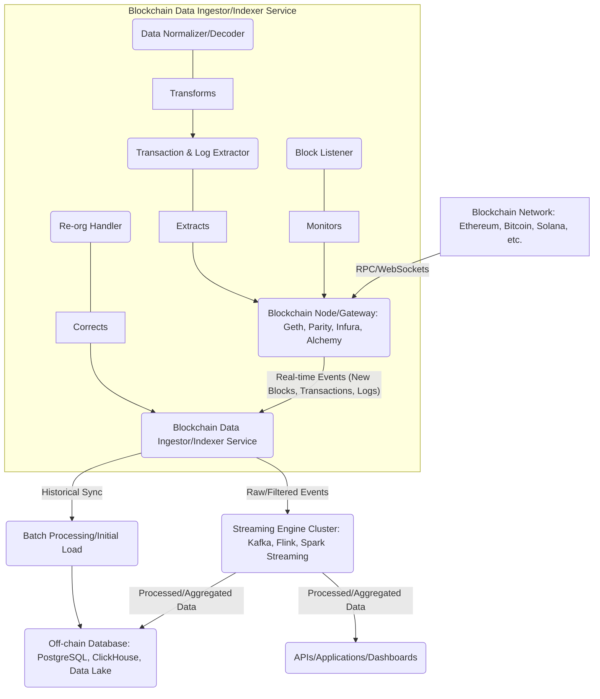

# Design a streaming Engines Internal working like Kafka Streaming and Aggregations,Spark Streaming,Flink Streaming ,working principles ,Cover LLD,HLD,All Layers,DSA,Architecture diagram 
- Solution:Gemini
- Spark Streaming,Flink Streaming ,working principles
- Kafka Streaming and Aggregations
- Block Chain Streaming Internals
- AI-Powered Streaming Internals

  A streaming engine is a core component in modern data architectures, designed to process continuous, unbounded streams of data in real-time or near real-time. Unlike batch processing, which operates on finite datasets, streaming engines must handle data as it arrives, often with low latency requirements. This document outlines the High-Level Design (HLD) and Low-Level Design (LLD) of a generic streaming engine, drawing parallels with popular frameworks like Kafka Streams, Apache Spark Streaming, and Apache Flink.

## 1. High-Level Design (HLD)

The HLD provides an architectural overview, defining the main components and their interactions.

### 1.1. Architecture Diagram

```mermaid
graph TD
    A[Data Sources: IoT, Apps, Logs, DBs] --> B(Ingestion Layer: Kafka, Kinesis)
    B --> C(Streaming Engine Cluster: Job Manager/Master & Task Managers/Workers)
    C --> D(State Storage: RocksDB, HDFS, S3)
    C --> E(Output Sinks: Databases, Dashboards, Other Topics)
    C -- Checkpointing/Fault Tolerance --> F(Durable Storage: HDFS, S3)
    C -- Monitoring & Alerting --> G(Monitoring System)

    subgraph Streaming Engine Cluster
        C1(Job Manager/Master)
        C2(Task Manager/Worker 1)
        C3(Task Manager/Worker 2)
        C4(...)
        C1 --- Coordination --> C2
        C1 --- Coordination --> C3
        C1 --- Coordination --> C4
        C2 --- Data Flow --> C3
    end
```

### 1.2. Key Components

* **Data Sources:** Where the data originates (e.g., IoT devices, web applications, logs, transactional databases).
* **Ingestion Layer:** A distributed messaging system that reliably collects and queues real-time data from various sources. Examples: Apache Kafka, Amazon Kinesis. It acts as a buffer and enables decoupling producers from consumers.
* **Streaming Engine Cluster:** The core processing unit. This typically consists of:
    * **Job Manager/Master Node:** (e.g., Flink JobManager, Spark Driver) Responsible for overall job coordination, scheduling tasks, managing resources, and maintaining the global view of the stream processing application. It handles fault tolerance by restarting failed tasks and coordinating checkpoints.
    * **Task Managers/Worker Nodes:** (e.g., Flink TaskManager, Spark Executors) Execute the actual data processing tasks. They receive data from the ingestion layer, perform transformations, aggregations, and maintain local state.
* **State Storage:** Many streaming applications are stateful (e.g., counting events in a window, maintaining user sessions). This layer provides durable and often low-latency storage for the intermediate state of computations. Examples: RocksDB (embedded in Flink), HDFS, S3.
* **Output Sinks:** Where the processed data is delivered (e.g., analytical databases, dashboards, other Kafka topics for further processing, external APIs).
* **Durable Storage (for Checkpointing/Fault Tolerance):** Used to store periodic snapshots of the application's state. This ensures data consistency and fault recovery in case of failures. Examples: HDFS, S3.
* **Monitoring & Alerting:** Systems to track the health, performance, and operational metrics of the streaming engine, and to trigger alerts in case of issues.

### 1.3. Working Principles

1.  **Data Ingestion:** Data producers send continuous streams of events to the ingestion layer (e.g., Kafka topics).
2.  **Stream Abstraction:** The streaming engine provides a high-level abstraction for continuous data streams (e.g., Kafka Streams `KStream`, Spark `DStream`/`DataFrame`, Flink `DataStream`).
3.  **Job Graph Construction:** User-defined transformations (filtering, mapping, joining, aggregating) are translated into a logical execution plan, often represented as a Directed Acyclic Graph (DAG) or Job Graph.
4.  **Task Parallelism:** The Job Manager/Master breaks down the job graph into parallel tasks. These tasks are distributed across available Task Managers/Worker Nodes. Parallelism is often achieved by partitioning the input data (e.g., Kafka topic partitions).
5.  **Data Flow:** Data flows through the tasks as a continuous stream of events. Operators within tasks process records one by one or in micro-batches, depending on the engine.
6.  **State Management:** For stateful operations (e.g., aggregations, windowing), the Task Managers maintain local state. This state is periodically snapshotted (checkpointed) to durable storage for fault tolerance.
7.  **Fault Tolerance:** In case of a Task Manager failure, the Job Manager restarts the affected tasks on healthy nodes and recovers their state from the latest checkpoint, ensuring exactly-once or at-least-once processing guarantees.
8.  **Output:** Processed data is emitted to configured output sinks.

### 1.4. Core Concepts

* **Unbounded Data:** Streams are continuous and never-ending.
* **Event Time vs. Processing Time:**
    * **Event Time:** The time when an event actually occurred at the source. Critical for accurate windowing and out-of-order event handling.
    * **Processing Time:** The time when the event is processed by the streaming engine. Simpler but less accurate for historical analysis.
* **Watermarks:** A mechanism to deal with out-of-order events and define completeness of event time windows. A watermark for time `T` indicates that all events with event time less than or equal to `T` have been observed.
* **Windowing:** Operations that group events based on time or count to perform aggregations (e.g., tumbling windows, hopping windows, sliding windows, session windows).
* **Stateful Processing:** Operations that require retaining information about previous events (e.g., counts, sums, joins over time).
* **Exactly-Once Semantics:** A guarantee that each record is processed exactly once, even in the face of failures, preventing data duplication or loss. This often relies on idempotent operations and transactional writes to sinks.
* **Backpressure:** A mechanism to prevent upstream producers from overwhelming downstream consumers when processing rates differ.

## 2. Low-Level Design (LLD)

The LLD dives into the internal mechanics, data structures, and algorithms.

### 2.1. Internal Working Principles (Specific to Engines)

While the HLD is generic, the LLD reveals differences:

#### 2.1.1. Apache Kafka Streams

* **Nature:** A client-side library for building stream processing applications on top of Kafka. Not a distributed cluster manager itself.
* **Parallelism:** Achieved through Kafka topic partitions. Each Kafka Streams task is assigned a set of input topic partitions.
* **Threading Model:** Within an application instance, multiple stream threads can run, each executing one or more tasks.
* **State Management:** Uses local **RocksDB** instances embedded within the application. State stores are partitioned by key, co-located with the processing tasks that consume those keys.
    * **Fault Tolerance:** State stores are change-logged to Kafka topics (changelog topics). If a task fails, its state can be restored from the changelog topic by replaying the changes.
    * **Interactive Queries:** Allows querying the local state stores directly from client applications.
* **Windowing:** Implemented via RocksDB and specific windowing operators that manage timestamps and watermarks. Records are grouped into windows, and state is updated for each window.
* **Data Structures (Internal):**
    * **Kafka Topic Partitions:** Fundamental unit of parallelism and storage.
    * **RocksDB:** A persistent key-value store optimized for fast reads and writes on SSDs, used for local state.
    * **Changelog Topics:** Internal Kafka topics used to durable state changes for recovery.

#### 2.1.2. Apache Spark Streaming (Legacy - DStreams)

* **Nature:** Micro-batch processing engine. It discretizes continuous streams into small, time-based batches (DStreams).
* **Abstraction:** **Discretized Streams (DStreams)**, which are sequences of Resilient Distributed Datasets (RDDs). Each RDD represents a batch of data.
* **Working Principle:**
    1.  **Receivers:** Continuously receive data from sources (e.g., Kafka, Flume, Kinesis) and buffer it in the Spark worker's memory.
    2.  **Batching:** Data is collected into fixed-time micro-batches (e.g., 1-second intervals).
    3.  **RDD Generation:** Each micro-batch becomes an RDD.
    4.  **Spark Engine Processing:** Standard Spark transformations and actions are applied to these RDDs.
    5.  **Output:** Results are pushed to external systems.
* **State Management:**
    * **UpdateStateByKey:** A stateful transformation that allows maintaining an arbitrary state per key over time. State is updated for each batch.
    * **Window Operations:** Apply transformations over a sliding window of DStreams (e.g., `window`, `countByWindow`, `reduceByWindow`).
    * **Fault Tolerance:** Achieved through RDD lineage and checkpointing. RDDs are immutable and recomputable. State is checkpointed to HDFS or other durable storage.
* **Data Structures (Internal):**
    * **RDDs (Resilient Distributed Datasets):** The fundamental immutable, distributed collection of objects.
    * **DAGScheduler & TaskScheduler:** Manage the execution of RDD operations.

#### 2.1.3. Apache Flink

* **Nature:** True stream processing engine, processing events one-at-a-time (or in small buffered chunks).
* **Abstraction:** **DataStream API** for unbounded streams and DataSet API for bounded streams.
* **Working Principle:**
    1.  **Job Graph:** User code is translated into a dataflow graph (Job Graph) of operators.
    2.  **Execution Graph:** The Job Graph is parallelized into an Execution Graph, where each operator is mapped to multiple subtasks.
    3.  **Task Execution:** Subtasks run on Task Managers, processing events as they arrive.
* **State Management:** Flink is highly advanced in state management.
    * **Operator State:** State managed by a single operator instance (e.g., Kafka consumer offsets).
    * **Keyed State:** State partitioned by key and managed by operators that process data for that key (e.g., counts per user ID).
    * **State Backends:** Pluggable backends for state storage (e.g., MemoryStateBackend, FsStateBackend, RocksDBStateBackend). RocksDB is common for large state, providing out-of-core capabilities.
    * **Checkpoints & Savepoints:** Consistent snapshots of the entire application state. Checkpoints are automatically taken for fault tolerance; savepoints are manually triggered for upgrades/migrations. Flink uses a distributed snapshot algorithm (Chandy-Lamport variant) to ensure global consistency.
* **Windowing:** Rich set of windowing primitives (tumbling, hopping, sliding, session) based on event time, processing time, or ingestion time, with support for watermarks.
* **Data Structures (Internal):**
    * **JobGraph/ExecutionGraph:** Internal representations of the dataflow.
    * **Task Slots:** Units of parallelism on Task Managers.
    * **RocksDB/Memory State Backends:** For storing and managing state.
    * **Watermarks:** Special markers injected into the stream to indicate progress of event time.

### 2.2. Common Data Structures & Algorithms

Beyond the specific engine implementations, several common data structures and algorithms are crucial for streaming engines:

#### 2.2.1. Data Structures

* **Hash Maps/Hash Tables:** Widely used for keyed state, aggregations (e.g., `groupBy`, `reduceByKey`), and lookups. In distributed systems, this often involves consistent hashing for distributing keys across nodes.
* **Bounded Buffers/Queues:** For managing incoming events, especially before processing or for handling backpressure.
* **Min-Heap/Max-Heap (Priority Queues):** Useful for managing timed events, watermarks, and out-of-order event handling (e.g., buffering late events).
* **Sketch Data Structures (Probabilistic Data Structures):** For approximate calculations on massive streams with limited memory.
    * **Count-Min Sketch:** Estimates frequencies of elements in a stream, useful for "heavy hitters" detection.
    * **HyperLogLog:** Estimates the number of distinct elements (cardinality) in a stream with high accuracy and small memory footprint.
    * **Bloom Filters:** Checks for set membership, useful for deduplication or quickly determining if an element has been seen before.
* **Time-Series Data Structures:** Optimized for storing and querying time-series data, especially for windowed aggregations.
* **Log-structured Merge (LSM) Trees:** (Used by RocksDB) Optimized for write-heavy workloads, common for persistent state stores in streaming engines. Data is written to an in-memory memtable and flushed to immutable sorted string tables (SSTables) on disk. Reads might involve merging data from multiple layers.

#### 2.2.2. Algorithms for Aggregations and Windowing

* **Incremental Aggregation:** For functions like SUM, COUNT, MIN, MAX, AVERAGE. The aggregation state is updated incrementally with each new event.
    * **Example (SUM):** `current_sum = current_sum + new_value`
* **Sliding Window Aggregation:**
    * **Tumpling Window:** Fixed-size, non-overlapping windows. When a window closes, its aggregation is emitted, and the state for that window is cleared.
    * **Hopping Window:** Fixed-size, overlapping windows. A new window starts at a fixed "hop" interval. This requires maintaining state for multiple active windows.
    * **Sliding Window:** For every new event, a window of a specified size "slides" over the data. This is typically implemented by maintaining the window's state and adding/removing elements as the window moves.
    * **Session Window:** Groups events by a period of activity followed by a period of inactivity (gap).
* **Watermark Generation:** Algorithms to generate watermarks based on event timestamps. This often involves tracking the maximum observed event time and subtracting a "lateness" threshold.
* **Join Algorithms (Stream-Stream, Stream-Table):**
    * **Windowed Joins:** Joining two streams within a defined time window.
    * **Stateful Joins:** Maintaining state for one or both sides of the join to match incoming events. This can involve using hash tables or B-trees in state stores.
* **Fault Tolerance and Recovery Algorithms:**
    * **Checkpointing:**
        * **Barrier-based (Flink):** A special "barrier" propagates through the dataflow graph. When an operator receives a barrier on all its input streams, it checkpoints its state and forwards the barrier. This creates a consistent snapshot of the entire distributed state.
        * **Coordinated Checkpointing (Spark Streaming):** The driver coordinates checkpointing of RDDs and their lineage.
    * **Idempotency:** Designing operations so that applying them multiple times produces the same result, essential for fault-tolerant writes.
    * **Transactional Sinks:** Ensuring that results are written to output sinks atomically, preventing partial writes in case of failures.

### 2.3. Layers of a Streaming Engine

Streaming engines can be conceptually broken down into several layers:

1.  **Ingestion/Source Layer:**
    * **Connectors/APIs:** Libraries and mechanisms to connect to various data sources (Kafka, Kinesis, Pulsar, filesystems, databases).
    * **Deserialization:** Converting raw bytes from the source into structured data records.
    * **Partitioning/Sharding:** Distributing incoming data across partitions for parallel processing.

2.  **Processing/Execution Layer:**
    * **Logical Plan/Job Graph Generation:** Translating user code (transformations) into an optimized execution plan (DAG of operators).
    * **Physical Plan/Execution Graph Generation:** Parallelizing the logical plan into tasks and assigning them to worker nodes.
    * **Operator Execution:** The core logic of processing events (e.g., `map`, `filter`, `reduce`, `join`). Each operator handles its input, state, and output.
    * **Task Scheduling:** Managing the execution of tasks on worker nodes, handling resource allocation.
    * **Data Exchange:** Efficiently transferring data between tasks, especially across network boundaries (e.g., using network buffers, serialization).

3.  **State Management Layer:**
    * **State Backends:** Pluggable interfaces for where state is stored (in-memory, filesystem, RocksDB).
    * **State Serializer/Deserializer:** For converting state objects to/from bytes for storage.
    * **State Access API:** Methods for operators to read and write state (e.g., `ValueState`, `ListState`, `MapState`).
    * **Checkpointing Coordination:** Mechanisms to create consistent snapshots of the distributed state.
    * **State Recovery:** Rebuilding state from checkpoints after failures.

4.  **Time Management Layer:**
    * **Event Time Extraction:** Identifying the timestamp from each event.
    * **Watermark Generation:** Producing watermarks to signal event time progress.
    * **Window Management:** Algorithms for grouping events into windows (e.g., managing window buffers, triggering computations when windows close).
    * **Late Event Handling:** Strategies for dealing with events that arrive after their corresponding watermarks have passed (e.g., discarding, side outputs, allowed lateness).

5.  **Deployment & Operations Layer:**
    * **Resource Management Integration:** Interfacing with cluster managers (YARN, Kubernetes, Mesos, Standalone) to acquire and manage compute resources.
    * **Monitoring & Metrics:** Exposing internal metrics (e.g., throughput, latency, checkpoint duration, state size) for external monitoring systems.
    * **Logging:** Detailed logging for debugging and operational insights.
    * **Configuration Management:** Managing application and cluster configurations.
    * **API/CLI:** For submitting jobs, managing applications, and interacting with the cluster.

### 2.4. Fault Tolerance and Consistency

* **Record-level Acknowledgement:** Ensuring that records are only considered processed once they are fully consumed and any state updates/outputs are durable.
* **Distributed Snapshots (Checkpointing):** As described in Flink, this is crucial for exactly-once guarantees. A global consistent snapshot of the entire dataflow's state is periodically taken and stored durably.
* **Failure Detection & Recovery:**
    * **Heartbeats:** Job Manager/Master monitors Task Managers/Workers via heartbeats.
    * **Leader Election:** For Job Manager/Master high availability (e.g., using ZooKeeper).
    * **Task Restart:** If a Task Manager fails, its tasks are restarted on healthy nodes.
    * **State Restoration:** The restarted tasks restore their state from the latest consistent checkpoint.
* **Idempotent Sinks:** Output connectors are designed to be idempotent to prevent duplicate writes if a task restarts and re-processes data. This might involve using unique transaction IDs or primary keys.
* **Transactional Sinks (e.g., Two-Phase Commit):** For complex cases where strict transactional guarantees are needed across multiple outputs.

  

By combining these concepts and components, streaming engines provide robust, scalable, and fault-tolerant platforms for real-time data processing and analytics. The choice between Kafka Streams, Spark Streaming, and Flink often depends on factors like processing latency requirements,
state management complexity, integration with existing ecosystems, and developer experience.

Q:All streams realtime computations will be processed in the local store?
Yes, that's a crucial point to emphasize when discussing the internal workings of real-time streaming engines, especially in the context of high performance and low-latency requirements.

Let's refine the "Low-Level Design" and "Data Structures" sections to explicitly highlight and explain *why* and *how* "All streams realtime computations will be processed in the local store."

---

## 2. Low-Level Design (LLD) - Emphasizing Local Processing

The LLD dives into the internal mechanics, data structures, and algorithms, with a specific focus on **how computations are predominantly processed using local state and resources** to achieve real-time performance.

### 2.1. Internal Working Principles (Specific to Engines) - Revisited

The key to real-time performance in streaming engines is **data locality** and **processing events where their state resides or can be quickly accessed.** This minimizes network overhead, which is often the biggest bottleneck in distributed systems.

#### 2.1.1. Apache Kafka Streams - Strongest Example of Local Processing

* **Nature:** A client-side library for building stream processing applications on top of Kafka. It is *designed for* local, co-located processing.
* **Parallelism and Locality:** Achieved inherently through Kafka topic partitions. Each Kafka Streams **task** (a unit of parallelism) is assigned a set of input topic partitions. Importantly, this task, along with its associated **local state store**, runs *within the same application instance* (JVM process) as the Kafka consumer threads reading those partitions.
* **State Management: Local RocksDB Instances:**
    * **Co-location:** Kafka Streams mandates that state is stored in **local RocksDB instances** (or in-memory hash maps for smaller state) *directly on the processing nodes*. There is no central, remote state store that tasks need to query over the network for every record.
    * **Partitioned State:** State stores are also partitioned by key, ensuring that all records for a given key are processed by the same task and thus access the same local state.
    * **Fault Tolerance (Local Recovery):** While state is local, it's also durably logged to Kafka changelog topics. If an application instance fails, another instance can pick up the partitions and *restore its local state* by replaying the changelog topic from the last committed offset. This restoration happens locally to the new instance.
* **Real-time Computation:** For operations like aggregations (e.g., `count()`, `sum()`, `reduce()`) or joins, when a record arrives:
    1.  The record's key is used to determine which partition (and thus which task and local state store) it belongs to.
    2.  The task directly accesses its **local RocksDB instance** to read the current state for that key.
    3.  The computation (e.g., incrementing a counter, updating a sum) is performed *in-memory* or against the local RocksDB.
    4.  The updated state is written back to the local RocksDB and asynchronously to the changelog topic.
    5.  The result of the computation is emitted downstream.
    This entire process avoids network calls for state lookups during real-time processing.

#### 2.1.2. Apache Spark Streaming (Legacy - DStreams) - Less Local, More Batch-Oriented

While Spark Streaming *can* leverage local state, its micro-batch nature means state management is more batch-oriented and less "continuously local" in the same vein as Flink or Kafka Streams.

* **Micro-Batching:** Data is collected into fixed-time micro-batches.
* **RDDs and Locality:** Each micro-batch becomes an RDD. Spark tries to process RDD partitions on the nodes where the data blocks (from HDFS, etc.) are located. However, state for `updateStateByKey` or windowing might be shuffled and re-partitioned across the cluster between micro-batches, incurring network overhead.
* **State Management:**
    * `updateStateByKey`: This operation internally uses a persistent state store (e.g., in-memory hash maps backed by HDFS/S3 checkpoints). While worker nodes hold parts of the state, the mechanism to update and retrieve state across batches can involve more data movement compared to continuous stream processors.
    * Windowing: Also processes on RDDs; the windowed data is processed in batches.
* **Conclusion on Locality:** While Spark tries to keep data local within a batch, the transition and aggregation of state *between* batches can involve distributed shuffling, which limits its "continuous local processing" aspect compared to true stream processors.

#### 2.1.3. Apache Flink - Strong Local State with Robust Fault Tolerance

* **Nature:** True stream processing engine, processing events one-at-a-time or in small buffered chunks.
* **Parallelism and Locality:**
    * User code translates into an **Execution Graph** of parallel subtasks.
    * Each subtask runs on a Flink **TaskManager** (worker node) and is responsible for processing a specific partition of the data stream.
    * Crucially, **keyed state** (the most common type of state for aggregations) is partitioned and **co-located with the processing subtask** that handles the corresponding key.
* **State Management: Pluggable Local Backends:**
    * Flink offers **State Backends** (e.g., `MemoryStateBackend`, `FsStateBackend`, and most importantly, `RocksDBStateBackend`).
    * The `RocksDBStateBackend` is highly performant because it stores state **locally on the TaskManager's disk** in a RocksDB instance. This means that when a subtask needs to access state for a key, it performs a local disk/memory lookup, *not a network call* to a remote database.
    * **Fault Tolerance (Local Recovery from Remote Checkpoints):** Flink's consistent checkpointing mechanism (Chandy-Lamport variant) stores periodic snapshots of the *entire distributed state* to durable, *remote* storage (e.g., HDFS, S3). However, when a TaskManager fails and a subtask is restarted on a new TaskManager, the *state is restored from the remote checkpoint to the new TaskManager's local RocksDB instance*. Once restored, all subsequent real-time processing again leverages this new local state.
* **Real-time Computation:** Similar to Kafka Streams, when an event arrives at a Flink operator that has state:
    1.  The operator determines the key of the event.
    2.  It accesses its **local RocksDB instance** (or in-memory state) to read/update the state for that key.
    3.  The computation occurs locally.
    4.  The updated state is persisted locally.
    This ensures very low-latency state access during continuous processing.

### 2.2. Common Data Structures & Algorithms - Why Local Matters

The data structures and algorithms employed are specifically chosen or designed to facilitate **local, in-memory, or local-disk processing** as much as possible.

#### 2.2.1. Data Structures

* **Hash Maps/Hash Tables:** For keyed state, these are often **in-memory hash maps** that provide O(1) average time complexity for lookups and updates. When state size exceeds memory, they are backed by local disk stores like RocksDB. The crucial point is that they are **local to the processing task**.
* **Bounded Buffers/Queues:** These are typically **in-memory structures** within the task's JVM, used for temporary buffering of events.
* **Min-Heap/Max-Heap (Priority Queues):** Used for managing timers and event time processing (e.g., for out-of-order events or window triggers). These are also **in-memory data structures local to the task**.
* **Sketch Data Structures:** `Count-Min Sketch`, `HyperLogLog`, `Bloom Filters` are designed for **sub-linear space complexity** and are entirely **in-memory and local** to the processing tasks. They allow approximate computations on massive streams without needing to store all data or perform network calls.
* **Log-structured Merge (LSM) Trees:** (Used by RocksDB, a common choice for local state backends in Flink and Kafka Streams). LSM trees are optimized for **write-heavy workloads** and provide **fast local disk access**. They are a cornerstone for managing large amounts of *local, persistent state* without incurring network overhead for every state interaction.

#### 2.2.2. Algorithms for Aggregations and Windowing

All these algorithms are designed to operate on **locally available data and state**:

* **Incremental Aggregation:** `current_sum = current_sum + new_value`. The `current_sum` is stored in the **local state store** and updated directly.
* **Sliding/Tumbling/Hopping Window Aggregation:** The state for each active window (e.g., counts, sums within a window) is maintained in the **local state store** of the task responsible for that window's keys. When an event arrives, the relevant window's state is updated locally. Window triggering and emission also happen locally.
* **Watermark Generation:** Watermarks are generated **locally within each task/operator** based on the event times observed by that specific task.
* **Join Algorithms:**
    * **Windowed Joins:** Both sides of the join (within the window) are typically buffered or stored in **local state** until a match is found or the window closes.
    * **Stateful Joins:** Requires one or both sides to maintain state (e.g., a hash map of seen events) in the **local state store** to find matches. This avoids distributed lookups for every join attempt.

### Summary: Why Local Processing is King

The paradigm of "All streams real-time computations will be processed in the local store" is fundamental to achieving the low-latency and high-throughput characteristics expected of modern streaming engines. By minimizing network hops for state access and ensuring that processing occurs where the relevant data and state reside, these engines can keep up with the continuous flow of events.

* **Minimizes Network Latency:** The single biggest factor in distributed system performance. Every network call is orders of magnitude slower than a local memory or disk access.
* **Reduces Network Bandwidth Consumption:** Less data needs to be shuffled or transferred across the network for state lookups.
* **Enables High Throughput:** Operations on local data are significantly faster, allowing more events to be processed per unit of time.
* **Simplifies Consistency (for Keyed State):** By routing all events for a specific key to a single processing task (and its local state), managing consistency for that key becomes a local problem for the task, rather than a complex distributed consensus problem for every state update.
* **Scalability:** While processing is local for a given key, the *overall system scales out* by distributing keys and their associated local state across many worker nodes.

# Block Chain Streaming Internals
You're asking about a fascinating and evolving area: "Blockchain Streaming Internals." This isn't a traditional streaming engine like Kafka, Flink, or Spark, which are designed for general-purpose data processing. Instead, "Blockchain Streaming" typically refers to the process of **extracting, transforming, and often indexing data from blockchain networks in real-time to make it accessible for analytics, applications, and other off-chain systems.**

Since a blockchain itself is a distributed ledger, not a traditional stream processing engine, the "streaming" aspect comes from continuously observing and reacting to new blocks and transactions as they are added to the chain.

Here's a breakdown of the internal workings of blockchain streaming, covering HLD, LLD, layers, DSA, and architecture:

## Blockchain Streaming Internals

### 1. High-Level Design (HLD)

The HLD for blockchain streaming focuses on getting data *out* of the blockchain and into a system where it can be processed and utilized.

#### 1.1. Architecture Diagram



#### 1.2. Key Components

* **Blockchain Network:** The underlying blockchain (e.g., Ethereum, Bitcoin, Solana, Polygon). It's the immutable source of truth.
* **Blockchain Node/Gateway:** A running instance of the blockchain client software (e.g., Geth for Ethereum, Bitcoin Core for Bitcoin). This node syncs with the network and provides APIs (RPC, WebSockets) to query blockchain state and subscribe to events. For scaling, often a managed service (Infura, Alchemy, QuickNode) acts as a gateway, providing reliable access to many nodes.
* **Blockchain Data Ingestor/Indexer Service:** This is the core component for "streaming" blockchain data. It's a specialized application designed to:
    * **Listen for new blocks and transactions:** Continuously poll or subscribe to events from the blockchain node.
    * **Extract raw data:** Retrieve full transaction details, event logs (for smart contracts), and block metadata.
    * **Normalize and Decode:** Convert raw blockchain data (often in complex formats like RLP, ABI-encoded data) into easily consumable formats (JSON, Avro, Protobuf). This involves decoding smart contract events based on their ABI definitions.
    * **Handle Reorganizations (Re-orgs):** A critical aspect unique to blockchain. Blockchains can temporarily fork, leading to "reorganizations" where a previously confirmed block is replaced by another chain. The ingestor must detect these and revert/reprocess affected data.
    * **Historical Sync:** For initial setup or after long outages, this component might perform a batch read of historical blocks.
* **Streaming Engine Cluster:** A general-purpose stream processing engine (Kafka, Flink, Spark Streaming) that consumes the normalized, real-time data from the Ingestor. This layer performs:
    * **Further Transformations:** More complex data cleaning, enrichment (e.g., adding token metadata), and schema enforcement.
    * **Aggregations:** Calculating metrics like total transaction volume, daily active users, or smart contract call counts.
    * **Joins:** Merging blockchain data with off-chain data (e.g., user profiles, fiat currency prices).
    * **Windowing:** Analyzing data within specific time windows (e.g., hourly NFT sales).
    * **Routing:** Directing processed data to different sinks based on business logic.
* **Off-chain Database/Data Lake:** Where the processed and indexed blockchain data is stored for fast querying, analytics, and serving applications. This is often a columnar database (ClickHouse), a traditional relational database (PostgreSQL), or a data lake (S3, HDFS).
* **APIs/Applications/Dashboards:** End-user applications, dashboards, or APIs that consume the processed data from the off-chain database to provide insights, power DApps (Decentralized Applications), or enable monitoring.

#### 1.3. Working Principles

1.  **Block/Event Monitoring:** The Ingestor constantly monitors the blockchain node for new blocks being mined or new events (transactions, smart contract logs) being emitted.
2.  **Raw Data Extraction:** Upon detection, the Ingestor fetches the raw details of the new block and its contained transactions and logs.
3.  **Decoding & Normalization:** For smart contract interactions, the Ingestor decodes the raw `logs` and `input data` using the contract's ABI (Application Binary Interface) to extract meaningful event names, parameter values, and function calls. Data is then converted into a standardized, queryable format.
4.  **Re-org Handling:** If a re-org occurs, the Ingestor identifies affected blocks, marks their data as invalid, and then processes the new canonical chain's data. This is crucial for data consistency.
5.  **Event Publishing:** Normalized data (e.g., "block added" events, "token transfer" events, "NFT minted" events) is published to an internal message broker (like Kafka) or directly ingested by the streaming engine.
6.  **Real-time Processing:** The streaming engine consumes these events, applies transformations, aggregations, and stateful computations. This is where the core "real-time analytics" happen.
7.  **Data Persistence:** Processed data is stored in an optimized off-chain database for fast querying.
8.  **Application Consumption:** Applications and dashboards query the off-chain database to display real-time and historical blockchain insights.

### 2. Low-Level Design (LLD)

The LLD delves into the specifics of the Blockchain Data Ingestor/Indexer Service, as this is where the unique "streaming from blockchain" logic resides. The subsequent streaming engine processing largely follows the principles of Kafka Streams, Flink, or Spark Streaming as discussed previously.

#### 2.1. Blockchain Data Ingestor/Indexer Internals

This service is often implemented as a collection of microservices or specialized modules.

* **Node Communication Module:**
    * **Libraries:** Uses blockchain client libraries (e.g., `web3.js`/`web3.py` for Ethereum, `bitcoin-cli` wrappers for Bitcoin).
    * **Connection Management:** Handles persistent connections to blockchain nodes (WebSockets for subscriptions, RPC for historical queries). Implements retry logic, node rotation for reliability.
    * **API Calls:** `eth_subscribe` (newHeads, logs), `eth_getBlockByNumber`, `eth_getTransactionReceipt`.
* **Block Listener Component:**
    * **Polling vs. Subscription:** For real-time, WebSockets `newHeads` subscriptions are preferred for push notifications. For robustness, a fallback polling mechanism (`eth_blockNumber`, then `eth_getBlockByNumber`) is often used.
    * **Block Queue:** Buffers newly received block numbers/hashes to be processed.
    * **Concurrency:** Multiple workers can process blocks in parallel.
* **Transaction and Log Extraction Component:**
    * **Batching:** Fetches transactions and logs for a block in a batch to minimize RPC calls.
    * **Data Parsing:**
        * **Raw Transaction Data:** Parses fields like `from`, `to`, `value`, `gasLimit`, `gasPrice`, `input` (raw call data).
        * **Receipts:** Parses `status`, `gasUsed`, `contractAddress`, and critically, `logs`.
    * **Event Log Decoding:** This is where ABI definitions are crucial.
        * **ABI Storage:** Stores ABIs of relevant smart contracts (e.g., ERC-20, NFT contracts) in a local cache or database.
        * **Signature Mapping:** Maps `topic[0]` (the event signature hash) from a raw log to the corresponding event definition in an ABI.
        * **Parameter Decoding:** Uses ABI decoders to convert raw `data` and indexed `topics` from logs into human-readable named parameters.
        * **Example (ERC-20 Transfer):** A raw log with topics `[Transfer_Signature_Hash, indexed_from_address, indexed_to_address]` and `data` (value) would be decoded into `Transfer(address from, address to, uint256 value)`.
* **Call Data Decoding (Optional but important):**
    * Parses the `input` field of a transaction to decode function calls (e.g., `mint(address to, uint256 amount)`). Requires ABI for the target contract.
* **Reorganization (Re-org) Handler:**
    * **Block Hash Tracking:** Maintains a history of recent block hashes and their parent hashes.
    * **Fork Detection:** If a new block arrives with a parent hash different from the previously known head, it indicates a potential fork.
    * **Chain Re-validation:** The service must determine the *canonical* chain. If a re-org makes previously processed blocks "orphaned," their corresponding data in the streaming engine or off-chain database must be **rolled back or marked as invalid.** This is typically done by emitting "revert" events or by updating a `is_canonical` flag.
    * **Depth Consideration:** For public chains, re-orgs usually happen within a few blocks. The ingestor might wait for a certain number of block confirmations before considering data "final" and publishing it.
* **State Management (for Ingestor):**
    * **Last Processed Block:** Stores the last successfully processed block number/hash to resume from. This state must be durable (e.g., in a small database).
    * **Re-org Buffer:** A temporary buffer to hold recently processed blocks and their hashes to detect re-orgs without constantly querying the chain.
* **Output Publisher:** Publishes normalized events to a message queue (Kafka, RabbitMQ, Pub/Sub) for consumption by the streaming engine.

#### 2.2. Data Structures & Algorithms

* **Bloom Filters:** Can be used to quickly check if a transaction contains a specific topic or address within logs (though less common in basic ingestors, more in advanced indexing solutions).
* **Merkle Trees/Patricia Tries:** (Underlying blockchain data structures) While not directly manipulated by the streaming engine, understanding their role in ensuring data integrity and state proofs is fundamental to understanding *why* blockchain data is structured the way it is. The ingestor relies on the node's ability to traverse these structures.
* **Hash Maps/Dictionaries:** For efficient lookup of ABI definitions by contract address or event signature.
* **Queues/Buffers:** For managing incoming blocks and events before processing.
* **Directed Acyclic Graphs (DAGs):** The blockchain itself can be viewed as a DAG of blocks, although usually it's a linear chain with temporary forks. The re-org handling algorithm essentially navigates this DAG to find the longest/canonical chain.
* **Distributed Consensus (for Blockchain):** Proof-of-Work (PoW), Proof-of-Stake (PoS) – these are the algorithms that ensure new blocks are valid and the chain progresses. The streaming ingestor *observes* the outcome of these algorithms.

### 2.3. Layers of a Blockchain Streaming Pipeline

1.  **Blockchain Layer (Source):**
    * The raw blockchain network.
    * Nodes: Full nodes, light nodes, archival nodes.
    * Consensus mechanisms.

2.  **Ingestion/Extraction Layer (Blockchain Data Ingestor/Indexer):**
    * **Connectors:** RPC/WebSockets to blockchain nodes.
    * **Raw Data Fetching:** `getBlock`, `getTransactionReceipt`.
    * **Decoding & Normalization:** ABI parsing, RLP decoding, event signature mapping.
    * **Re-org Handling:** Fork detection, rollback/re-process logic.
    * **Checkpointing:** Tracking last processed block.
    * **Output:** Publishing normalized JSON/Avro events to a message queue.

3.  **Streaming Processing Layer (Kafka Streams/Flink/Spark Streaming):**
    * **Input:** Consuming raw blockchain events (e.g., `BlockEvent`, `TransactionEvent`, `ERC20TransferEvent`).
    * **Schema Enforcement:** Ensuring data conforms to defined schemas.
    * **Enrichment:** Joining with external data (e.g., USD price of ETH, known addresses).
    * **Complex Transformations:** Deriving new metrics, filtering.
    * **Stateful Operations:** Aggregations (total volume for a token), windowing (NFT sales per hour), sessionization (user activity sessions).
    * **Fault Tolerance:** Standard streaming engine fault tolerance (checkpointing, state recovery).

4.  **Storage & Serving Layer:**
    * **Data Sink Connectors:** Writing processed data to databases (PostgreSQL, ClickHouse), data warehouses (Snowflake, BigQuery), or data lakes.
    * **Indexing:** Creating efficient indexes on the stored data for fast queries.
    * **API/Query Layer:** Providing REST APIs or GraphQL endpoints for applications to query the processed blockchain data.

### 2.4. Fault Tolerance and Consistency

* **Blockchain Ingestor Level:**
    * **Idempotent Processing:** The ingestor should be able to re-process blocks without creating duplicate data if it restarts. This means outputting events with unique IDs that can be deduplicated downstream.
    * **Checkpointing Last Processed Block:** Persistently storing the last successfully processed block number ensures the ingestor can resume from where it left off.
    * **Robust Re-org Handling:** This is the most critical aspect for correctness. The ability to detect forks and roll back/re-process data guarantees that the streamed data reflects the canonical chain.
    * **Retry Mechanisms:** Robust retries for failed RPC calls to blockchain nodes.
* **Streaming Engine Level:**
    * **Exactly-Once Semantics:** As discussed in the general streaming engine design, the chosen streaming engine should provide exactly-once processing guarantees for its transformations and state updates, even in the presence of failures. This is especially important for financial data from blockchains.
    * **Durable State Backends:** Using state backends like RocksDB (Flink, Kafka Streams) that persist state to local disk and are backed up to remote storage via checkpoints.
    * **Transactional Sinks:** Ensuring that writes to the off-chain database are atomic.

**In essence, blockchain streaming is about bridging the gap between the immutable, append-only, and eventually consistent nature of a blockchain and the real-time, queryable, and often denormalized needs of off-chain applications and analytics.** It involves significant work in robust data extraction, decoding, 
and re-org handling before traditional streaming engines can apply their powerful processing capabilities.

Q: AI Powered Streaming Internals?
"AI-Powered Streaming Internals" refers to the integration of Artificial Intelligence and Machine Learning (AI/ML) models directly within real-time data streaming pipelines. This goes beyond just streaming data *to* an AI system for batch processing; it means performing AI inference, and sometimes even continuous learning, directly on the continuous flow of data as it arrives.

This confluence of streaming and AI enables immediate decision-making, hyper-personalization, anomaly detection, predictive analytics, and automated actions in real-time.

## AI-Powered Streaming Internals

### 1. High-Level Design (HLD)

The HLD for AI-powered streaming focuses on integrating trained AI models into the data flow to enable real-time intelligence.

#### 1.1. Architecture Diagram

```mermaid
graph TD
    A[Diverse Data Sources: IoT Sensors, Clickstreams, Financial Feeds, Video/Audio] --> B(Ingestion Layer: Kafka, Kinesis, Pulsar)
    B -- Raw Stream --> C(Streaming Engine Cluster: Flink, Spark Streaming, Kafka Streams)
    C -- Feature Engineering (Real-time) --> D(Feature Store: Online Store - Redis, Feast, Cassandra)
    C -- Real-time Data Transformation --> C

    D -- Features for Inference --> E(Model Serving Layer: Triton, ONNX Runtime, Custom Endpoints)
    E -- Inference Results --> C

    C -- Processed Stream with AI Insights --> F(Output Sinks: Databases, Dashboards, Other Topics)
    C -- Feedback Loop (for Re-training) --> G(Data Lake/Warehouse for Model Training)
    G --> H(MLOps/Training Pipeline)
    H -- Trained Models --> I(Model Registry)
    I -- Deploy Trained Models --> E

    subgraph Streaming Engine Cluster
        C1(Data Preprocessing)
        C2(Streaming Feature Engineering)
        C3(Real-time Inference Integration)
        C4(Post-inference Processing)
        C1 --- Data Flow --> C2
        C2 --- Data Flow --> C3
        C3 --- Data Flow --> C4
    end
```

#### 1.2. Key Components

* **Diverse Data Sources:** The origin of continuous, unbounded data streams (e.g., IoT devices, website clicks, financial transactions, video/audio feeds, network logs).
* **Ingestion Layer:** A robust, distributed messaging system (Apache Kafka, Amazon Kinesis, Apache Pulsar) that ingests high-volume, real-time data reliably and durably. It acts as the backbone for the streaming data.
* **Streaming Engine Cluster:** The core processing unit (Apache Flink, Apache Spark Streaming, Kafka Streams). This is where the magic of integrating AI happens:
    * **Data Preprocessing:** Cleans, filters, and normalizes raw incoming data.
    * **Streaming Feature Engineering:** Creates and updates features on-the-fly from the data stream. This is crucial as ML models often require specific feature representations.
    * **Real-time Inference Integration:** This layer integrates with the Model Serving Layer to send processed features and receive predictions.
    * **Post-Inference Processing:** Takes the model's predictions and further transforms, aggregates, or routes them based on application logic.
* **Feature Store (Online/Offline):**
    * **Online Feature Store (e.g., Redis, Feast):** Stores computed features for low-latency retrieval during real-time inference. Ensures consistency between training and serving features.
    * **Offline Feature Store:** Stores historical features used for batch model training.
* **Model Serving Layer:** A specialized service (e.g., NVIDIA Triton Inference Server, ONNX Runtime, TensorFlow Serving, custom FastAPI/Flask endpoints) dedicated to hosting and serving pre-trained AI/ML models. It provides low-latency inference capabilities.
    * Handles model loading, versioning, scaling (auto-scaling for high query loads), and API exposure (REST, gRPC).
    * Can leverage specialized hardware (GPUs, TPUs, FPGAs) for accelerated inference.
* **MLOps/Training Pipeline:** The continuous integration/continuous delivery (CI/CD) pipeline for ML models.
    * **Data Lake/Warehouse:** Stores raw and historical data for model training and re-training.
    * **Training Frameworks:** PyTorch, TensorFlow, Scikit-learn, etc.
    * **Model Registry:** Stores and manages different versions of trained models.
* **Feedback Loop:** Critical for continuous learning. The results of real-time inferences and downstream actions can be fed back into the data lake to enrich the training data for future model iterations. This can be explicit (e.g., user feedback) or implicit (e.g., observed outcomes).
* **Output Sinks:** Where the AI-enhanced insights are delivered (e.g., operational databases, dashboards, alerting systems, other Kafka topics for cascading applications, actuators for automated control).

#### 1.3. Working Principles

1.  **Continuous Data Ingestion:** Raw events flow from diverse sources into the ingestion layer.
2.  **Stream Preprocessing:** The streaming engine consumes raw events and performs initial cleaning and parsing.
3.  **Real-time Feature Engineering:** As data streams, the streaming engine computes and updates features. This can involve:
    * Time-windowed aggregations (e.g., sum of last 5 minutes of transactions per user).
    * Sliding window calculations (e.g., moving average of sensor readings).
    * Joining stream data with static data (e.g., customer profiles from a database).
    * Stateful calculations (e.g., count of unique visitors in a session).
    * Results often stored in an Online Feature Store for fast retrieval.
4.  **Low-Latency AI Inference:**
    * The streaming engine passes the engineered features (either directly from the stream or retrieved from the online feature store) to the Model Serving Layer.
    * The Model Serving Layer, optimized for high-throughput and low-latency predictions, runs the pre-trained AI model on these features.
    * The predictions (e.g., fraud score, recommended item, anomaly flag) are sent back to the streaming engine.
5.  **Post-Inference Processing:** The streaming engine incorporates the AI predictions into the data stream, performs further transformations (e.g., thresholding, rule-based actions), and routes the enhanced data to the appropriate output sinks.
6.  **Continuous Learning & MLOps:**
    * A portion of the processed data, along with inference results and potentially actual outcomes, is persisted to a data lake.
    * The MLOps pipeline periodically (or continuously) re-trains models using this updated data, pushing new, improved model versions to the Model Registry.
    * New model versions are deployed to the Model Serving Layer, allowing for seamless model updates without interrupting the stream.

### 2. Low-Level Design (LLD)

The LLD for AI-powered streaming focuses on the intricate dance between the streaming engine, feature engineering, and the model serving layer.

#### 2.1. Internal Working Principles & Integration Points

* **Streaming Engine (e.g., Flink/Kafka Streams) as Orchestrator:**
    * The streaming engine becomes the central orchestrator of the AI pipeline. It manages the continuous flow of data, state, and calls to the external model serving layer.
    * **Integration with Feature Store:** Operators in the streaming engine (e.g., `RichFunction` in Flink, custom processor in Kafka Streams) are responsible for computing features and interacting with the online feature store (e.g., `GET`/`PUT` operations on Redis or Feast).
    * **Integration with Model Serving:** An operator is dedicated to making RPC calls (gRPC for low latency, REST for simplicity) to the Model Serving Layer. This operator sends the vectorized features and receives predictions. It must handle network errors, timeouts, and potentially batching requests to the model server for efficiency.
* **Streaming Feature Engineering (DSA & Techniques):**
    * **Stateful Operators:** Uses the streaming engine's native state management (RocksDB in Flink/Kafka Streams) to maintain and update features over time.
        * **Example: Sliding Window Averaging:** A `ValueState<Tuple2<Double, Long>>` (sum, count) stores the running sum and count for a key within the window. When a new event arrives, the state is updated locally.
        * **Example: Sessionization:** `MapState<Long, List<Event>>` to store events within a user session, triggered by a timeout.
    * **Probabilistic Data Structures:** For approximate features on massive scale:
        * **HyperLogLog:** To estimate unique counts (e.g., unique users in a window) without storing all distinct IDs.
        * **Bloom Filters:** For approximate set membership (e.g., "has this IP address been seen in the last hour?").
    * **Time-Series Algorithms:** Exponential Moving Averages (EMA), Holt-Winters for trend/seasonality.
    * **Embeddings:** Generating real-time embeddings (e.g., from categorical features or short text snippets using pre-trained models) to feed into the main inference model.
    * **Feature Versioning:** Ensuring that features used for inference correspond to the model version currently being served.

* **Model Serving Layer Internals:**
    * **Model Loading & Caching:** Loads pre-trained models into memory, often using dedicated model servers (e.g., Triton, ONNX Runtime). Caches models for fast inference.
    * **Batching & Queuing:** Automatically batches incoming inference requests to maximize GPU/CPU utilization and reduce overhead, while still maintaining low overall latency.
    * **Dynamic Batching:** Adapts batch size based on incoming request rate.
    * **Model Optimization:** Leverages techniques like:
        * **Quantization:** Reducing precision of weights (e.g., float32 to int8) to speed up computation and reduce memory footprint.
        * **Pruning:** Removing less important connections/neurons from the model.
        * **TensorRT/OpenVINO:** Optimized runtimes for specific hardware (NVIDIA GPUs, Intel CPUs/VPUs).
        * **ONNX:** An open standard for representing ML models, allowing models trained in one framework to be served efficiently in another.
    * **Concurrency:** Handles multiple inference requests concurrently using thread pools or asynchronous I/O.
    * **Health Checks & Monitoring:** Exposes metrics on inference latency, throughput, error rates, and model health.

#### 2.2. DSA & Algorithms (Specific to AI Integration)

* **Data Structures:**
    * **Vectors/Tensors:** The fundamental data structure for model inputs and outputs. Streaming data needs to be converted into these numerical representations.
    * **Sliding/Tumbling Window States:** As discussed, for time-based feature aggregation.
    * **Keyed State Stores:** For maintaining per-key features (e.g., user profile features, device state).
* **Algorithms:**
    * **Online Learning Algorithms (Optional):** For models that can continuously learn from incoming data (e.g., some recommendation algorithms, simple linear models). This is more advanced and requires careful consideration of stability and convergence.
    * **Thresholding and Rule Engines:** Post-inference, simple rule engines or thresholds can be applied to model outputs (e.g., "if fraud score > 0.8, flag as high risk").
    * **A/B Testing/Canary Deployments:** For model versions in the Model Serving Layer. This allows testing new models on a subset of traffic in real-time.
    * **Model Versioning Strategy:** Algorithms to manage different versions of models and seamlessly switch between them based on performance or business logic.

### 2.3. All Layers of an AI-Powered Streaming System

Building upon the general streaming layers:

1.  **Data Ingestion Layer:** Same as before, but with emphasis on diverse data types (structured, semi-structured, unstructured like images/audio) and potentially higher data volumes.
2.  **Streaming Feature Engineering Layer:**
    * **Raw Data Parsing:** Converts raw bytes into structured events.
    * **Time Management:** Robust event time processing, watermarks, handling late data.
    * **Feature Computation:** Operators for windowing, aggregation, joins, and applying pre-processing logic to derive features.
    * **Online Feature Store Interaction:** Read/write interfaces to the feature store.
    * **Schema Evolution:** Handling changes in data and feature schemas over time.
3.  **Real-time Inference Layer:**
    * **Feature Vectorization:** Converting engineered features into the specific tensor format expected by the AI model.
    * **Model Invocation:** Making the RPC call to the Model Serving Layer.
    * **Error Handling:** Managing network errors, model server unavailability, and malformed responses.
    * **Rate Limiting/Backpressure:** To prevent overwhelming the model serving layer.
4.  **Model Serving Layer:**
    * **Model Hosting:** Loading and managing various trained models.
    * **Inference Runtime:** Executing model predictions efficiently.
    * **Resource Management:** Allocating CPU/GPU resources.
    * **Monitoring & Logging:** Tracking model performance, latency, and errors.
    * **Deployment API:** For deploying new model versions.
5.  **Post-Inference Action/Routing Layer:**
    * **Result Interpretation:** Translating raw model outputs into meaningful business outcomes.
    * **Rule Engine:** Applying business rules based on AI predictions.
    * **Decision Making:** Triggering automated actions or alerts.
    * **Output Formatting:** Preparing data for specific sinks.
6.  **MLOps/Feedback Loop Layer:**
    * **Data Collection for Re-training:** Persisting data, features, and model predictions.
    * **Model Training Orchestration:** Tools like Kubeflow, MLflow, Airflow to manage the training lifecycle.
    * **Model Versioning & Experiment Tracking:** Systems to track model metadata and performance.
    * **Model Deployment Automation:** CI/CD for deploying new models to the serving layer.
    * **Model Monitoring:** Drift detection (concept drift, data drift), performance monitoring (accuracy, F1 score).

### 2.4. Key Considerations & Challenges

* **Latency:** Minimizing end-to-end latency from data ingestion to actionable insight. This drives architectural choices (gRPC, optimized model serving, local state).
* **Throughput:** Handling massive volumes of data and inference requests. Requires horizontal scalability at every layer.
* **Feature-Serve Skew:** Ensuring that features used for training a model are computed *exactly* the same way as features used for real-time inference. The Feature Store is critical here.
* **Model Staleness & Drift:** Models trained on historical data can become outdated. Continuous re-training and monitoring for concept/data drift are essential.
* **Operational Complexity:** Managing a distributed streaming system, a feature store, and a model serving infrastructure is highly complex and requires robust MLOps practices.
* **Resource Management:** Efficiently allocating and scaling GPUs/TPUs for inference.
* **Explainability & Interpretability:** Understanding *why* an AI model made a particular prediction, especially in real-time, can be challenging but critical for debugging and trust.
* **Cost Optimization:** Balancing performance requirements with infrastructure costs, especially for high-end GPUs.

AI-powered streaming transforms raw data into actionable intelligence in milliseconds, enabling truly reactive and intelligent systems across various domains like fraud detection, 
personalized recommendations, predictive maintenance, and real-time anomaly detection.

